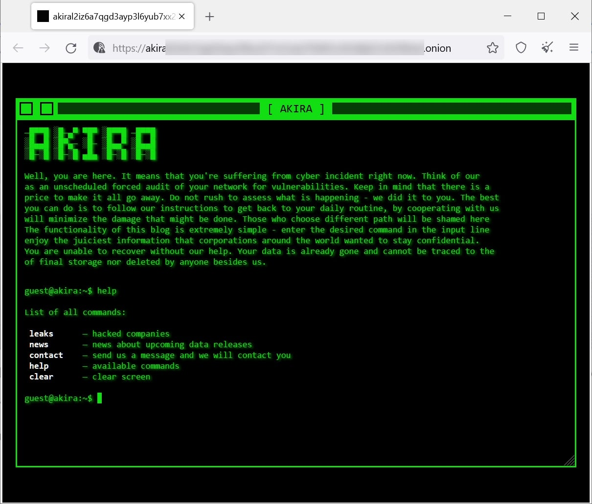

  

# Threat Actor - AKIRA

Akira é um grupo de ransomware relativamente novo e de rápido crescimento — observado pela primeira vez em março de 2023 — que aproveita o modelo de negócios ransomware-as-a-service (RaaS) para implantar o ransomware Akira. Semelhante a outros grupos RaaS proeminentes, o Akira exfiltra dados antes de criptografar os dispositivos das vítimas e os utiliza para realizar dupla extorsão.

Em primeiro lugar, os operadores do ransomware Akira são cibercriminosos motivados financeiramente. Eles estão nisso pelo dinheiro e já ganharam muito em 2023, não está claro exatamente quanto. Mas relatos da mídia pública afirmam que entre março e julho de 2023, o grupo comprometeu pelo menos 63 vítimas, o que é cerca de quatro organizações atingidas pelo ransomware Akira por semana — que sabemos. Das negociações vistas pelo BleepingComputer , a gangue do ransomware exige resgates que variam de 200.000 a milhões de dólares americanos.

O grupo realiza as habituais campanhas de extorsão dupla, em que os arquivos da vítima são criptografados e as informações são roubadas e publicadas em seu site de vazamento de dados Tor (DLS) se o resgate não for pago. Fornecedores privados de segurança cibernética rastreiam os operadores Akira como Punk Spider ( CrowdStrike ) e Gold Sahara ( Secureworks ).

  

Diamond Model - AKIRA
Também é importantes termos uma visão geral da ameaça, quais são os padrões de suas Capacidades, de sua Infraestrutura e de suas Vítimas. Para isso, nós também desenvolvemos um Diamond Model, para que possamos ter uma visão técnica geral de quem é o grupo AKIRA Ransomware.

  

## Pesquisas

O Purple Team irá iniciar o processo de pesquisas, referentes a Táticas, Técnicas, Procedimentos, e Ferramentas utilizadas pelo ator **AKIRA** durante suas operações. O objetivo deste esforço é desenvolver pesquisas e detecções para o máximo de etapas possíveis, referentes a *Kill Chain* deste adversário.

### Mapeamento de Táticas e Técnicas do MITRE ATT&CK Utilizados na Kill Chain do Akira

Abaixo é possível observar o mapeamento de Táticas e Técnicas do *MITRE ATT&CK* em detalhes através de uma lista viva, com todas as pesquisas produzidas até o momento, que podem ser acessadas por meio da tabela abaixo.

<table>
  <thead>
    <tr>
      <th>Tática</th>
      <th>Técnica</th>
      <th>Tática ID</th>
    </tr>
  </thead>
  <tbody>
    <tr>
      <td>Initial Access</td>
      <td><a href="LINK PESQUISA">Valid Accounts</a>
      <td>T1078</td>
    </tr>
    <tr>
      <td>Initial Access</td>
      <td><a href="LINK PESQUISA">Exploit Public-Facing Application</a></td>
      <td>T1190</td>
    </tr>
    <td>Persistence</td>
      <td><a href="LINK PESQUISA">Create Account: Domain Account</a>
      <td>T1136.002</td>
    </tr>
    </tr>
    <td>Execution</td>
      <td><a href="https://github.com/ish-cti-purple/CTI-PurpleTeam/tree/main/Pesquisas/ATT%26CK%20TTPs/%5BTA0002%5D%20Execution/%5BT1059%5D%20Command%20and%20Scripting%20Interpreter">Command and Scripting Interpreters</a>
      <td>T1059</td>
    </tr>
    </tr>
    <td>Defense Evasion</td>
      <td><a href="https://github.com/ish-cti-purple/CTI-PurpleTeam/blob/main/Pesquisas/ATT%26CK%20TTPs/%5BTA0005%5D%20Defense%20Evasion/%5BT1562%5D%20Impair%20Defenses/%5BT1562.001%5D%20Impair%20Defenses%3A%20Disable%20or%20Modify%20Tools/CTI%20Purple%20Team%20-%20Evasao%20de%20Defesa%20Atrav%C3%A9s%20do%20CLR%20Profiler/CTI%20Purple%20Team%20-%20Evasao%20de%20Defesa%20Atrav%C3%A9s%20do%20CLR%20Profiler.md">Impair Defenses: Disable or Modify Tools</a>
      <td>T1562.001</td>
    </tr>
    </tr>
    <td>Credential Access</td>
      <td><a href="https://github.com/ish-cti-purple/CTI-PurpleTeam/blob/main/Pesquisas/ATT%26CK%20TTPs/%5BTA0006%5D%20Credential%20Access/%5BT1003%5D%20OS%20Credential%20Dumping/%5BT1003.001%5D%20CTI%20Purple%20Team%20-%20OS%20Credential%20Dumping%3ALsass%20Memory/CTI%20Purple%20Team%20-%20OS%20Credential%20Dumping%3A%20LSASS%20Memory/pesquisa.md">OS Credential Dumping: LSASS Memory</a>
      <td>T1003.001</td>
    </tr>
    </tr>
    <td>Discovery</td>
      <td><a href="LINK PESQUISA">System Information Discovery</a>
      <td>T1082</td>
    </tr>
    </tr>
    <td>Discovery</td>
      <td><a href="LINK PESQUISA"> Permission Groups Discovery: Domain Groups</a>
      <td>T1069.002</td>
    </tr>
    </tr>
    <td>Discovery</td>
      <td><a href="LINK PESQUISA">Remote System Discovery</a>
      <td>T1018</td>
    </tr>
    </tr>
    <td>Command and Control</td>
      <td><a href="LINK PESQISA">Remote Access Software</a>
      <td>T1219</td>
    </tr>
    </tr>
    <td>Lateral Movement</td>
      <td><a href="https://github.com/ish-cti-purple/CTI-PurpleTeam/blob/main/Pesquisas/ATT%26CK%20TTPs/%5BTA0008%5D%20Lateral%20Movement/%5BT1570%5D%20Lateral%20Tool%20Transfer/CTI%20Purple%20Team%20-%20Movimenta%C3%A7%C3%A3o%20Lateral%20Atrav%C3%A9s%20do%20PSExec/CTI%20Purple%20Team%20-%20Movimenta%C3%A7%C3%A3o%20Lateral%20Atrav%C3%A9s%20do%20PSExec.md">Lateral Tool Transfer</a>
      <td>T1570</td>
    </tr>
    </tr>
    <td>Exfiltration</td>
      <td><a href="https://github.com/ish-cti-purple/CTI-PurpleTeam/blob/main/Pesquisas/ATT%26CK%20TTPs/%5BTA0010%5D%20Exfiltration/%5BT1567%5D%20Exfiltration%20Over%20Web%20Service/%5BT1567.002%5D%20Exfiltration%20Over%20Web%20Service%3A%20Exfiltration%20to%20Cloud%20Storage/CTI-Purple-Team-Exfiltra%C3%A7%C3%A3o-de-arquivos-para-servi%C3%A7os-cloud/CTI%20Purple%20Team%20-%20Exfiltra%C3%A7%C3%A3o%20de%20arquivos%20para%20servi%C3%A7os%20cloud.md"> Exfiltration Over Web Service: Exfiltration to Cloud Storage</a>
      <td>T1567.002</td>
    </tr>
    </tr>
    <td>Exfiltration</td>
      <td><a href="LINK"> Exfiltration Over Alternative Protocol: Exfiltration Over Unencrypted Non-C2 Protocol</a>
      <td>T1048.003</td>
    </tr>
    </tr>
    <td>Impact</td>
      <td><a href="https://github.com/ish-cti-purple/CTI-PurpleTeam/blob/main/Pesquisas/ATT%26CK%20TTPs/%5BTA0040%5D%20Impact/%5BT1490%5D%20Inhibit%20System%20Recovery/%5BCTI%20Purple%20Team%5D%20Inibi%C3%A7%C3%A3o%20de%20Recupera%C3%A7%C3%A3o%20do%20Sistema.md">Inhibit System Recovery</a>
      <td>T1490</td>
    </tr>
    </tr>
    <td>Impact</td>
      <td><a href="LINK">Data Encrypted for Impact</a>
      <td>T1486</td>
    </tr>
  </tbody>
</table>

---------------------------

