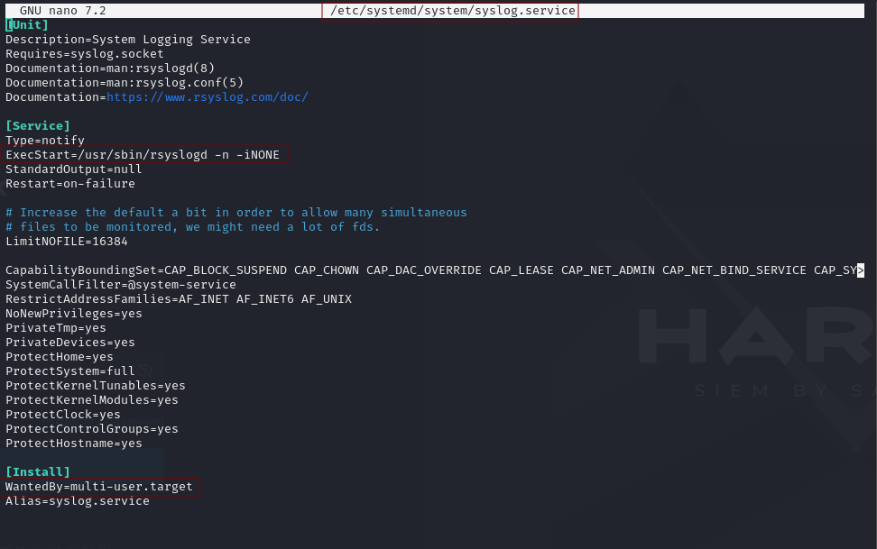

<p align="center">
  
</p>

# CTI Purple Team - Criação de Processo do Sistema Através do Systemd Service

<kbd>Pesquisador</kbd> : <span style="color:purple"> **Bryenne Bonfim**</span>

<kbd>Tipo de Ameaça</kbd> : <span style="color:orange"> **TTP**</span>

<kbd>TLP</kbd> : <span style="color:red"> **RED**</span>

<kbd>Nível de Impacto</kbd> : <span style="color:red"> **Médio**</span>

<kbd>Tipo de Impacto</kbd> : <span style="color:red"> **Persistência**</span>
-----------

## Introdução

**Systemd** é um gerenciador de sistema e serviços amplamente adotado para controlar processos em segundo plano, conhecidos como daemons ou serviços, além de outros recursos do sistema. Ele é altamente eficiente na implementação e manutenção da [*Persistência*](https://attack.mitre.org/tactics/TA0003/). uma técnica descrita pelo [*MITRE ATT&CK*](https://attack.mitre.org/) como [*Create or Modify System Process: Systemd Service - T1543.002*](https://attack.mitre.org/techniques/T1543/002/). Systemd é o sistema de inicialização padrão em várias distribuições Linux, substituindo sistemas init mais antigos, como SysVinit e Upstart, enquanto mantém compatibilidade com versões anteriores.

Os serviços gerenciados pelo Systemd oferecem uma oportunidade significativa para adversários que buscam persistência. Com permissões adequadas, um invasor pode criar um serviço malicioso, similar ao que é possível no Windows, permitindo sua continuidade entre reinicializações e potencialmente com privilégios de root.

O Metasploit Framework já incorporou essa técnica de persistência em suas funcionalidades. Usando o módulo de persistência de serviço, um invasor pode criar arquivos de serviço no disco para rodar como serviços de sistema ou de usuário. Esta funcionalidade está disponível na ferramenta desde dezembro de 2018.

O objetivo desta pesquisa é desenvolver inteligência por meio da emulação da técnica T1543.002, visando criar assinaturas de detecção para os principais arquivos criados recentemente com indicações de serem arquivos .service maliciosos.

## Contexto

Os serviços do Systemd são amplamente utilizados para controlar processos em segundo plano, conhecidos como daemons. Muitos processos essenciais do sistema Linux são iniciados durante o processo de inicialização. Veja alguns exemplos de serviços que você pode conhecer:

- /etc/systemd/system/sshd.service: Serviço Secure Shell
- /lib/systemd/system/systemd-logind.service: Serviço de Gerenciamento de Sessões
- /lib/systemd/system/rsyslog.service: Serviço de Log do Sistema
- /lib/systemd/system/cron.service: Daemon de processamento de programa em segundo plano regular

Graças a esses arquivos de serviço, processos como **sshd**, **rsyslogd** e **cron** começarão a ser executados assim que o sistema for iniciado.

No entanto, o systemd pode ser explorado por atacantes para implementar seus próprios serviços maliciosos, garantindo que, mesmo após uma reinicialização, seu serviço  backdoor ou beacon será reiniciado. Para adicionar um novo serviço, um arquivo de unidade **`*.service`** unit é criado em `/etc/systemd/system/`ou `/lib/systemd/system/`.

Vamos examinar o arquivo `*rsyslog.service*` para ver um exemplo concreto de configuração:

<p align="center">
  
 <br>
  Figura 1: Arquivo do rsyslog.sevice.
</p>

Há duas seções nas quais queremos nos concentrar:

- **ExecStart:** Este é o comando que é executado quando o serviço é iniciado
- **WantedBy:** Ter um valor de multi-user.target significa que o serviço deve iniciar no momento da inicialização.

## Emulação de Ameaça - Instalando um Serviço Malicioso

Neste tópico iremos habilitar um serviço no systemd para nos gerar uma shell reverso para manter persistência na máquina da vítima. Esse porcesso poderia ser tanto uma shell reversa ou um Metasploit ou payloads de scripts de inicialização contendo códigos maliciosos para exfiltração de dados e muitos outros.

Para instalar um serviço, precisamos primeiro criar um arquivo unitário `<SERVICE>.service` em um dos caminhos de carga unitária do systemd.

<table>
  <thead>
    <tr>
      <th>Caminho</th>
      <th>Descrição</th>
    </tr>
  </thead>
  <tbody>
    <tr>
      <td>/etc/systemd/system</td>
      <td>Unidades do sistema criadas pelo administrador</td>
    </tr>
    <tr>
      <td>/usr/lib/systemd/system</td>
      <td>Unidades de sistema instaladas pelo administrador</td>
    </tr>
    <tr>
      <td>/lib/systemd/system</td>
      <td>Unidades de sistema instaladas pelo gerenciador de pacotes de distribuição</td>
    </tr>
    <tr>
      <td>/usr/local/lib/systemd/system</td>
      <td>Unidades de sistema instaladas pelo gerenciador de pacotes de distribuição</td>
    </tr>
    <tr>
      <td>/run/systemd/system</td>
      <td>Diretório temporário onde o `systemd` coloca unidades de sistema que são criadas dinamicamente durante a execução</td>
    </tr>
    <tr>
  </tbody>
</table>

Os caminhos completos e a ordem que systemd procurarão pelos arquivos unitários podem ser enumerados usando o comando `systemd-analyze unit-paths`. Por exemplo:

<p align="center">
  
 <br>
  Figura 2: Caminhos de arquivos unitários enumerados.
</p>

Esta é a ordem exata e os locais systemd de onde os serviços serão carregados. Alguns locais, como /run/*são transitórios e não persistem quando a máquina é desligada.

> [!NOTE]
> O primeiro arquivo `*.service` na lista será usado. Por exemplo, se `/lib/systemd/system/nginx.service`, já existe e nós criamos `/etc/systemd/system/nginx.service`, então estamos substituindo o *nginx.service* porque `/etc/systemd/system` tem precedência sobre `/lib/systemd/system/nginx.service`. Isso pode ser algo que podemos explorar se quisermos comprometer serviços existentes em vez de criar um novo.

Com base nestas informações, queremos criar um serviço chamado `httpservice`. Então criamos este arquivo direto no caminho onde ele ficará instalado em `/etc/systemd/system/httpservice.service`.

<p align="center">
  
 <br>
  Figura 3: Criação do arquivo *.service* com uma Shell Reversa.
</p>

Uma vez criado, precisamos habilitar o serviço para que ele seja executado quando a máquina inicializar. A maneira padrão de fazer isso é usanso o comando a seguir:

```zsh
systemctl enable httpservice.service
```

> [!NOTE]
>Se você nomeou seu serviço `netdns.service`, por exemplo, então você executará `systemctl enable netdns`. 

Este comando procurará por um arquivo `httpservice.service` em um dos caminhos da unidade, analisará e criará um **`symlink`** para cada alvo na configuração `WantedBy`.

Desde então **WantedBy=multi-user.target**, o diretório de destino seria `/etc/systemd/system/multi-user.target.wants` e podemos criar manualmente o link simbólico, caso necessário:

```zsh
ln -s /etc/systemd/system/httpservice.service /etc/systemd/system/multi-user.target.wants/httpservice.service
```

<p align="center">
  
 <br>
  Figura 4: Criação do serviço e Symlink gerado.
</p>

Após o symlink ser criado, o SO saberá que deve ser executado `httpservice.service` quando a máquina for inicializada. Para executar o serviço manualmente, você pode executar o comando: `systemctl start httpservice`. 

> [!NOTE]
>Se você modificar um arquivo de unidade, precisará recarregá-lo usando `systemctl daemon-reload`

Neste exemplo, ExecStart é um shell reverso, mas pode ser substituí-lo por qualquer comando que desejar. Pode ser um **python3** ou você pode apontar para um **script bash** ou executável como **/tmp/backdoor** ou **/opt/backdoor**.

## Detecção de Ameaça - Procurando Criação de Serviço Usando Auditd

Para monitorar a criação de serviços do sytemd usando auditd, você pode configurar regras de auditoria para capturar execuções de processos que são iniciados pelo servidor de serviços do systemd. O objetivo é capturar a criação de qualquer arquivo com a extensão `.service`.

```zsh
-w /usr/lib/systemd/ -p wa -k systemd
-w /lib/systemd/ -p wa -k systemd

# Directories may not exist
-w /usr/local/lib/systemd/ -p wa -k systemd
-w /usr/local/share/systemd/user -p wa -k systemd_user
-w /usr/share/systemd/user  -p wa -k systemd_user
```

> [!NOTE]
>As regras comentadas podem não ser imediatamente aplicáveis ​​porque podem não existir dependendo da distro que você está usando. Não podemos usar regras auditd para diretórios que não existem no momento em que o serviço é iniciado.

Obtemos os seguintes logs analisados ​​pelo auditd:

<p align="center">
  
  <br>
  Figura 5: Log Bruto Analisado opelo Auditd.
</p>

Aqui está um exemplo de um log gerados pelo auditd no Siem

<p align="center">
  
  <br>
  Figura 6: Logs gerados pelo Auditd no SIEM
</p>

## Engenharia de Detecção

Na seção a seguir, vamos sintetizar como caçar os indicadores de comprometimento produzidos pela criação de arquivos **.service** no Systemd em busca de persistência.

### Caçando Indicadores de Comprometimento 

Nesta seção, vamos sintetizar os principais pontos que podemos utilizar para construir uma detecção eficaz para monitorar os eventos relacionados à criação e modificações de arquivos **.service** em `systemd`. Com base no comportamento observado durante a emulação da criação de arquivos maliciosos para manter persistência e escalação de privilégio, os principais pontos de detecção são:

Como vimos, a instalação de um serviço é simplesmente a criação de um arquivo e a criação de um symlink. Temos que procurar por modificação e criação de arquivo em caminhos persistentes listados em `systemd-analyze unit-paths`.

Ao executar, os comandos especificados por um serviço systemd devem sempre ter um processo pai de systemd. 

- **Processo-pai**: o systemd processo pai deve ter um ID de processo 1, mas há casos extremos em que isso pode não acontecer. 
- **Usuário**: Por padrão, os serviços de nível de sistema serão executados como o usuário `root`.
- **Systemd enable**: `systemctl enable <name>` permite que o systemd o carregue como um serviço na inicialização e `systemctl start <name>` executa os comandos especificados pelo arquivo de serviço sob demanda.
- Configurar **auditd** para monitorar criação e modificações de arquivos **.service**.

----------------

### Padrão SIGMA: Create or Modify System Process: Systemd Service

```yaml
title: 'Linux - Criação de Processo do Sistema Através do Systemd Service- BASELINE'
id: 938732d4-b880-4498-ab19-232ccc5797a0
status: stable
description: 'Detecta a criação de processos do sistema utilizando o Systemd Service'
references: 
    - 'https://attack.mitre.org/techniques/T1543/002/'
author: CTI Purple Team - Bryenne Soares
date: 06/09/2024
tags:
    - attack.persistence.TA0003
    - attack.T1543.002 # Create or Modify System Process: Systemd Service
logsource:
    category: process_creation
    product: Linux
    definition: auditd and SysmonForLinux
detection:
    Process_Creation:
      EventID:
        - 11
      TargetFilename|contains:
        - '/etc/systemd/system/*.service'
    selection1|contains:
    - 'auditd.log.name: "/etc/systemd/system/*.service"'
      'auditd.log.nametype: "CREATE"'
    selection2|contains:
    - 'auditd.summary.object.primary: "/etc/systemd/system/*.service"'
      'file.path: "/etc/systemd/system/*.service"'
    selection3|contains:
    - 'process.title: "*nano /etc/systemd/system/*.service*"'
    - 'file.path: "/etc/systemd/system/*.service"'
    - 'process.title: "*sudo systemctl enable /etc/systemd/system/*.service*"'
    condition: selection1 or selection2 or selection3
fields:
    - 'process.name'
    - 'process.title'
    - 'file.path'
    - 'auditd.log.name'
    - 'auditd.log.nametype'
    - 'auditd.summary.object.primary'
falsepositives:
    - "É necessário validar se foi realizado uma ação administrativa de conhecimento da equipe de infraestrutura"
level: high
```

## Conclusão

Esperamos que você que leu ou assistiu o Webinar, possa ter compreendido a inteligência que trouxemos nesta pesquisa. Qualquer dúvida, é só nos contactar.

## Link do Webinar

Caso você não pode participar do Webinar de apresentação da pesquisa, ou gostaria rever, basta clicar neste [link]().


